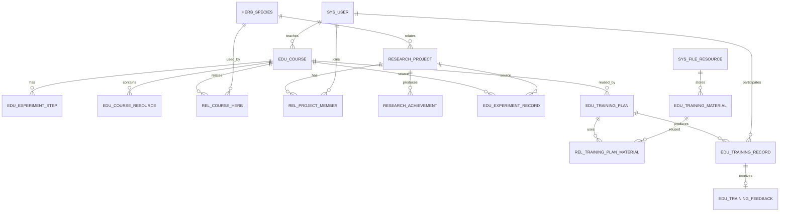

# 生物医药数字信息系统 M12-M15 数据库与接口补充设计

> 版本：V1.0  
> 日期：2026-07-10  
> 补充对象：`04_接口设计说明书_V1.0_全组_20260708.md`、`05_数据库详细设计说明书_V0.5_全组.md`  
> 适用模块：M12 实验课程、M13 课题研究、M14 实验记录、M15 培训过程

---

## 1. 补充目的

原数据库设计已经提供 M12-M15 的核心主表，但从任务清单、需求分析和模块设计反向核对后，仍有以下问题：

1. M14 在接口设计中整章缺失；
2. M12 缺少课程详情、步骤维护、发布和资源解绑接口；
3. M13 缺少课题详情、成员维护、课题材料和状态维护接口；
4. M15 缺少培训素材库、素材复用、参与记录更新、反馈查询和统计接口；
5. 培训素材“可独立存储并被多个培训计划复用”的需求缺少专用表；
6. 若干原接口字段与数据库字段不一致；
7. 实验记录归属、成员历史、培训参与去重、反馈去重等约束尚未落实。

本补充文档遵循“尽量复用原表、只补必要结构”的原则，不重写原数据库与接口设计。

---

## 2. 与原文档的合并方式

### 2.1 数据库文档

在《05_数据库详细设计说明书》执行以下操作：

1. 在数据库表清单中增加：
   - `edu_training_material`
   - `rel_training_plan_material`
   - `rel_course_herb`，P1 可选
2. 在对应原表章节追加“补充字段与约束”；
3. 在教学科研 ER 图中补充新关系；
4. 将模块覆盖检查表中 M15 的支撑表更新为：

```text
edu_training_plan、edu_training_material、rel_training_plan_material、
edu_training_record、edu_training_feedback
```

### 2.2 接口文档

在《04_接口设计说明书》执行以下操作：

1. 扩展原 `3.11 M12 实验课程接口`；
2. 扩展原 `3.12 M13 课题研究接口`；
3. 新增 `3.13 M14 实验记录接口`；
4. 原 `3.13 M15 培训过程接口` 调整为 `3.14` 并扩展；
5. 后续 M16-M20 章节编号顺延一位。

---

# 第一部分 数据库补充设计

## 3. 数据库差异与处理决策

| 编号 | 原设计问题 | 处理方式 |
|---|---|---|
| DB-01 | M15 有“培训素材页、素材上传、资料复用”需求，但无素材主表 | 新增 `edu_training_material` |
| DB-02 | 素材需被多个培训计划复用 | 新增 `rel_training_plan_material` |
| DB-03 | M12 模块设计提到课程关联药材，但无关系表 | 新增可选表 `rel_course_herb` |
| DB-04 | 课程发布状态无发布人和发布时间 | `edu_course` 增加 `published_by`、`published_at` |
| DB-05 | 课程资源接口包含排序，但表中无排序字段 | `edu_course_resource` 增加 `sort_order` |
| DB-06 | 课题成员变更需要保留历史，但关系表只有加入时间 | `rel_project_member` 增加成员状态、退出时间 |
| DB-07 | “阶段成果”无法区分阶段 | `research_achievement` 增加阶段和成果状态 |
| DB-08 | 实验记录只有归档状态，没有提交人、提交时间和归档人 | `edu_experiment_record` 增加流程字段 |
| DB-09 | 实验记录可同时关联课程和课题，缺少互斥约束 | 增加课程/课题二选一约束 |
| DB-10 | 培训计划接口含课程 ID，但表无 `course_id` | `edu_training_plan` 增加可选 `course_id` |
| DB-11 | 需求包含地点和讲师，培训计划表未保存 | 增加 `location`、`trainer_id` |
| DB-12 | 培训参与过程需要签到和结果备注 | `edu_training_record` 增加签到字段和结果备注 |
| DB-13 | 同一计划可重复插入同一学员 | 增加 `(plan_id, user_id)` 唯一索引 |
| DB-14 | 同一参与记录可重复反馈 | 增加 `(training_record_id, user_id)` 唯一索引 |
| DB-15 | M13 保存接口包含“经费”，需求和表结构均未定义 | 从接口请求中删除“经费”，本期不新增预算字段 |

---

## 4. 新增表一：`edu_training_material`

### 4.1 表定位

- 对应模块：M15 培训过程模块
- 优先级：P1
- 表说明：独立维护课件、讲义、视频、案例和习题等培训素材，使同一素材可被多个培训计划复用。
- 与文件模块关系：文件实体仍由 `sys_file_resource` 保存，本表只保存培训业务元数据。

### 4.2 字段设计

| 字段名 | 数据类型 | 必填 | 默认值 | 键/索引 | 说明 |
|---|---|---:|---|---|---|
| id | BIGINT | 是 | 自增 | PK | 主键 |
| material_no | VARCHAR(64) | 是 | 无 | UK | 素材编号 |
| material_name | VARCHAR(200) | 是 | 无 | IDX | 素材名称 |
| material_type | VARCHAR(50) | 是 | 无 | IDX | courseware、handout、video、case、exercise |
| description | TEXT | 否 | NULL |  | 素材说明 |
| file_id | BIGINT | 是 | 无 | FK/IDX | 文件资源 ID |
| source_type | VARCHAR(50) | 否 | upload | IDX | upload、course_resource、generated |
| source_resource_id | BIGINT | 否 | NULL | IDX | 来源课程资源 ID |
| uploader_id | BIGINT | 否 | NULL | FK/IDX | 上传人 ID |
| uploaded_at | DATETIME | 否 | CURRENT_TIMESTAMP | IDX | 上传时间 |
| reuse_count | INT | 否 | 0 |  | 被培训计划复用次数 |
| status | TINYINT | 否 | 1 | IDX | 0 禁用，1 正常 |
| is_deleted | TINYINT | 否 | 0 | IDX | 逻辑删除 |
| created_at | DATETIME | 否 | CURRENT_TIMESTAMP |  | 创建时间 |
| updated_at | DATETIME | 否 | CURRENT_TIMESTAMP |  | 更新时间 |
| created_by | BIGINT | 否 | NULL |  | 创建人 |
| updated_by | BIGINT | 否 | NULL |  | 更新人 |
| deleted_at | DATETIME | 否 | NULL |  | 删除时间 |
| deleted_by | BIGINT | 否 | NULL |  | 删除人 |
| remark | VARCHAR(500) | 否 | NULL |  | 备注 |
| version | INT | 否 | 0 |  | 乐观锁版本 |

### 4.3 索引与关系

```text
uk_edu_training_material_material_no(material_no)
idx_edu_training_material_name(material_name)
idx_edu_training_material_type(material_type)
idx_edu_training_material_file_id(file_id)
idx_edu_training_material_uploader_id(uploader_id)
```

逻辑外键：

```text
file_id -> sys_file_resource.id
source_resource_id -> edu_course_resource.id
uploader_id -> sys_user.id
```

---

## 5. 新增表二：`rel_training_plan_material`

### 5.1 表定位

维护培训计划和培训素材的多对多关系。

### 5.2 字段设计

| 字段名 | 数据类型 | 必填 | 默认值 | 键/索引 | 说明 |
|---|---|---:|---|---|---|
| id | BIGINT | 是 | 自增 | PK | 主键 |
| plan_id | BIGINT | 是 | 无 | FK/IDX | 培训计划 ID |
| material_id | BIGINT | 是 | 无 | FK/IDX | 培训素材 ID |
| is_required | TINYINT | 否 | 1 |  | 是否必学 |
| sort_order | INT | 否 | 0 |  | 排序号 |
| created_at | DATETIME | 否 | CURRENT_TIMESTAMP |  | 创建时间 |
| created_by | BIGINT | 否 | NULL |  | 创建人 |
| remark | VARCHAR(500) | 否 | NULL |  | 备注 |

### 5.3 索引与关系

```text
uk_rel_training_plan_material_plan_material(plan_id, material_id)
idx_rel_training_plan_material_plan_id(plan_id)
idx_rel_training_plan_material_material_id(material_id)
```

逻辑外键：

```text
plan_id -> edu_training_plan.id
material_id -> edu_training_material.id
```

---

## 6. 新增表三：`rel_course_herb`，P1 可选

### 6.1 表定位

课程可能涉及一个或多个中药材。使用关系表比在 `edu_course` 中加入单个 `species_id` 更适合多药材实验课程。

### 6.2 字段设计

| 字段名 | 数据类型 | 必填 | 默认值 | 键/索引 | 说明 |
|---|---|---:|---|---|---|
| id | BIGINT | 是 | 自增 | PK | 主键 |
| course_id | BIGINT | 是 | 无 | FK/IDX | 课程 ID |
| species_id | BIGINT | 是 | 无 | FK/IDX | 药材品种 ID |
| relation_type | VARCHAR(50) | 否 | experiment_object | IDX | 实验对象、教学案例等 |
| sort_order | INT | 否 | 0 |  | 排序号 |
| created_at | DATETIME | 否 | CURRENT_TIMESTAMP |  | 创建时间 |
| created_by | BIGINT | 否 | NULL |  | 创建人 |
| remark | VARCHAR(500) | 否 | NULL |  | 备注 |

索引：

```text
uk_rel_course_herb_course_species(course_id, species_id)
idx_rel_course_herb_course_id(course_id)
idx_rel_course_herb_species_id(species_id)
```

---

## 7. 原表补充字段与约束

### 7.1 `edu_course`

新增字段：

| 字段名 | 类型 | 默认值 | 说明 |
|---|---|---|---|
| published_at | DATETIME | NULL | 发布时间 |
| published_by | BIGINT | NULL | 发布人 ID |

业务规则：

- `publish_status=draft` 时，发布字段为空；
- 发布成功后写入当前用户和当前时间；
- 取消发布时状态变为 `offline`，保留最后一次发布时间用于审计。

### 7.2 `edu_course_resource`

新增字段：

| 字段名 | 类型 | 默认值 | 说明 |
|---|---|---|---|
| sort_order | INT | 0 | 同一课程资源排序 |

应用层约束：同一课程、同一资源类型下不得重复绑定同一 `file_id`。

### 7.3 `rel_project_member`

新增字段：

| 字段名 | 类型 | 默认值 | 说明 |
|---|---|---|---|
| member_status | VARCHAR(50) | active | active、left |
| left_at | DATETIME | NULL | 退出时间 |

原唯一索引 `(project_id, user_id)` 保留。成员退出后再次加入时复用原记录，将状态改回 `active` 并更新 `joined_at`，避免产生重复历史行。

### 7.4 `research_achievement`

新增字段：

| 字段名 | 类型 | 默认值 | 说明 |
|---|---|---|---|
| achievement_stage | VARCHAR(50) | final | initial、middle、final |
| achievement_status | VARCHAR(50) | draft | draft、submitted、confirmed |

### 7.5 `edu_experiment_record`

新增字段：

| 字段名 | 类型 | 默认值 | 说明 |
|---|---|---|---|
| submitted_at | DATETIME | NULL | 提交时间 |
| submitted_by | BIGINT | NULL | 提交人 ID |
| archived_by | BIGINT | NULL | 归档人 ID |
| archive_comment | VARCHAR(500) | NULL | 归档说明 |

新增检查约束：

```text
course_id 与 project_id 必须且只能有一个不为空
```

推荐状态：

```text
draft、submitted、archived
```

### 7.6 `edu_training_plan`

新增字段：

| 字段名 | 类型 | 默认值 | 说明 |
|---|---|---|---|
| course_id | BIGINT | NULL | 可选关联课程 ID |
| trainer_id | BIGINT | NULL | 主讲人或培训讲师 ID |
| location | VARCHAR(255) | NULL | 培训地点或线上会议地址 |
| published_at | DATETIME | NULL | 发布时间 |
| published_by | BIGINT | NULL | 发布人 ID |

逻辑外键：

```text
course_id -> edu_course.id
trainer_id -> sys_user.id
published_by -> sys_user.id
```

### 7.7 `edu_training_record`

新增字段：

| 字段名 | 类型 | 默认值 | 说明 |
|---|---|---|---|
| attendance_status | VARCHAR(50) | pending | pending、present、late、absent、leave |
| checked_in_at | DATETIME | NULL | 签到时间 |
| result_comment | VARCHAR(500) | NULL | 结果备注、补考说明等 |

新增唯一索引：

```text
uk_edu_training_record_plan_user(plan_id, user_id)
```

应用层校验：

```text
0 <= progress <= 100
0 <= score <= 100
```

### 7.8 `edu_training_feedback`

新增唯一索引：

```text
uk_edu_training_feedback_record_user(training_record_id, user_id)
```

应用层校验：

```text
1 <= rating <= 5
```

---

## 8. 文件业务关联约定

不为课题材料和实验附件重复创建附件表，统一使用 `sys_file_business`。

| 业务场景 | biz_type | file_usage |
|---|---|---|
| 课题过程材料 | `research_project` | `process_material` |
| 课题证明材料 | `research_project` | `evidence` |
| 实验记录附件 | `edu_experiment_record` | `attachment` |
| 实验现场图片 | `edu_experiment_record` | `image` |
| 培训计划补充附件 | `edu_training_plan` | `attachment` |

培训素材库使用 `edu_training_material.file_id` 保存主文件，不再通过多态表保存核心关系。

---

## 9. 补充后的关系图



---

# 第二部分 接口补充设计

## 10. 通用约定

沿用原接口说明书：

- 基础路径：`/api`
- 认证：`Authorization: Bearer <accessToken>`
- 分页：`pageNo`、`pageSize`
- 排序：`sortField`、`sortOrder`
- 统一响应：`code`、`message`、`data`、`traceId`、`timestamp`
- 新增成功建议返回 201，普通成功返回 200
- 删除采用逻辑删除
- 状态冲突返回 409

权限编码细分原则：查询、详情、新增、修改、删除、状态操作分开授权，不再使用一个 `save` 权限覆盖全部写操作。

---

## 11. M12 实验课程接口补充

### 11.1 完整接口清单

| 状态 | 接口名称 | 方法 | 路径 | 权限编码 | 核心参数 | 核心响应 | 审计 |
|---|---|---|---|---|---|---|---|
| 保留并扩展 | 课程分页查询 | GET | `/api/courses` | `edu:course:list` | keyword、courseType、teacherId、publishStatus、时间、分页 | 课程分页 | 否 |
| 新增 | 课程详情 | GET | `/api/courses/{id}` | `edu:course:detail` | id | 课程、教师摘要、步骤、资源、关联药材 | 否 |
| 修订 | 新增课程 | POST | `/api/courses` | `edu:course:add` | `CourseCreateDTO` | 课程详情 | 操作日志、数据变更 |
| 修订 | 修改课程 | PUT | `/api/courses/{id}` | `edu:course:update` | `CourseUpdateDTO`、version | 课程详情 | 操作日志、数据变更 |
| 新增 | 删除课程 | DELETE | `/api/courses/{id}` | `edu:course:delete` | id | success | 操作日志、数据变更 |
| 新增 | 发布课程 | POST | `/api/courses/{id}/publish` | `edu:course:publish` | version | 发布状态 | 操作日志、数据变更 |
| 新增 | 取消发布 | POST | `/api/courses/{id}/unpublish` | `edu:course:publish` | version、reason | 下线状态 | 操作日志、数据变更 |
| 新增 | 实验步骤查询 | GET | `/api/courses/{id}/steps` | `edu:course-step:list` | courseId | 步骤列表 | 否 |
| 新增 | 新增实验步骤 | POST | `/api/courses/{id}/steps` | `edu:course-step:save` | stepNo、title、content、expectedResult、sortOrder | 步骤详情 | 操作日志、数据变更 |
| 新增 | 修改实验步骤 | PUT | `/api/courses/{id}/steps/{stepId}` | `edu:course-step:save` | 步骤字段、version | 步骤详情 | 操作日志、数据变更 |
| 新增 | 删除实验步骤 | DELETE | `/api/courses/{id}/steps/{stepId}` | `edu:course-step:delete` | courseId、stepId | success | 操作日志、数据变更 |
| 保留 | 课程资源查询 | GET | `/api/courses/{id}/resources` | `edu:course-resource:list` | resourceType | 资源列表 | 否 |
| 修订 | 绑定课程资源 | POST | `/api/courses/{id}/resources` | `edu:course-resource:add` | fileId、resourceName、resourceType、sortOrder | 资源详情 | 操作日志、数据变更 |
| 新增 | 解绑课程资源 | DELETE | `/api/courses/{id}/resources/{resourceId}` | `edu:course-resource:delete` | resourceId | success | 操作日志、数据变更 |
| 可选 | 设置关联药材 | PUT | `/api/courses/{id}/herbs` | `edu:course:update` | speciesIds | 药材摘要列表 | 操作日志、数据变更 |

### 11.2 关键 DTO

#### `CourseCreateDTO`

```json
{
  "courseNo": "COURSE-2026-001",
  "courseName": "黄连鉴别实验",
  "courseType": "experiment",
  "teacherId": 1001,
  "description": "课程简介",
  "videoUrl": null,
  "startedAt": "2026-07-10 09:00:00",
  "endedAt": "2026-07-20 18:00:00",
  "speciesIds": [1],
  "steps": []
}
```

新增课程时强制保存为 `draft`，不接受客户端直接传入 `published`。

### 11.3 异常情况

- 课程编号重复：409
- 教师不存在：404
- 起止时间非法：400
- 无实验步骤时发布：409
- 存在实验记录时删除：409
- 文件不存在或已删除：404
- 版本冲突：409

---

## 12. M13 课题研究接口补充

### 12.1 完整接口清单

| 状态 | 接口名称 | 方法 | 路径 | 权限编码 | 核心参数 | 核心响应 | 审计 |
|---|---|---|---|---|---|---|---|
| 保留并扩展 | 课题分页 | GET | `/api/research-projects` | `research:project:list` | keyword、projectType、leaderId、speciesId、projectStatus、分页 | 课题分页 | 否 |
| 新增 | 课题详情 | GET | `/api/research-projects/{id}` | `research:project:detail` | id | 课题、成员、药材、材料、成果摘要 | 否 |
| 修订 | 新增课题 | POST | `/api/research-projects` | `research:project:add` | `ResearchProjectCreateDTO` | 课题详情 | 操作日志、数据变更 |
| 修订 | 修改课题 | PUT | `/api/research-projects/{id}` | `research:project:update` | `ResearchProjectUpdateDTO`、version | 课题详情 | 操作日志、数据变更 |
| 新增 | 修改课题状态 | POST | `/api/research-projects/{id}/status` | `research:project:status` | targetStatus、reason、version | 状态结果 | 操作日志、数据变更 |
| 新增 | 成员列表 | GET | `/api/research-projects/{id}/members` | `research:project-member:list` | memberStatus | 成员列表 | 否 |
| 新增 | 添加成员 | POST | `/api/research-projects/{id}/members` | `research:project-member:add` | userId、memberRole | 成员详情 | 操作日志、数据变更 |
| 新增 | 修改成员角色 | PUT | `/api/research-projects/{id}/members/{userId}` | `research:project-member:update` | memberRole | 成员详情 | 操作日志、数据变更 |
| 新增 | 成员退出 | DELETE | `/api/research-projects/{id}/members/{userId}` | `research:project-member:remove` | reason | success | 操作日志、数据变更 |
| 新增 | 课题材料列表 | GET | `/api/research-projects/{id}/materials` | `research:project-material:list` | fileUsage | 材料列表 | 否 |
| 新增 | 绑定课题材料 | POST | `/api/research-projects/{id}/materials` | `research:project-material:add` | fileId、fileUsage、remark | 关联详情 | 操作日志 |
| 新增 | 解绑课题材料 | DELETE | `/api/research-projects/{id}/materials/{fileId}` | `research:project-material:delete` | fileId | success | 操作日志 |
| 保留并扩展 | 科研成果分页 | GET | `/api/research-achievements` | `research:achievement:list` | projectId、type、stage、status、分页 | 成果分页 | 否 |
| 新增 | 科研成果详情 | GET | `/api/research-achievements/{id}` | `research:achievement:detail` | id | 成果详情 | 否 |
| 修订 | 新增科研成果 | POST | `/api/research-achievements` | `research:achievement:add` | 编号、课题、名称、类型、阶段、文件 ID | 成果详情 | 操作日志、数据变更 |
| 修订 | 修改科研成果 | PUT | `/api/research-achievements/{id}` | `research:achievement:update` | 成果字段、version | 成果详情 | 操作日志、数据变更 |

### 12.2 原接口字段修订

原“保存课题”接口中的“经费”字段删除。修订后的核心请求字段：

```text
projectNo、projectName、projectType、leaderId、speciesId、description、
startedAt、endedAt、projectStatus
```

理由：需求分析和原数据库均未定义预算管理，本期不扩大业务边界。

### 12.3 成员历史规则

- 添加已退出成员时，恢复原关系并更新 `joined_at`；
- 删除成员接口不物理删除，将 `member_status` 更新为 `left`；
- 项目负责人必须是有效成员；
- 更换负责人应在同一事务中完成负责人字段和成员角色调整。

### 12.4 异常情况

- 课题编号重复：409
- 负责人、成员或药材不存在：404
- 重复添加有效成员：409
- 直接移除负责人：409
- 项目状态流转非法：409
- 文件不存在：404

---

## 13. M14 实验记录接口，新增整章

### 13.1 完整接口清单

| 接口名称 | 方法 | 路径 | 权限编码 | 核心参数 | 核心响应 | 涉及表 | 审计 |
|---|---|---|---|---|---|---|---|
| 实验记录分页 | GET | `/api/experiment-records` | `edu:experiment-record:list` | keyword、sourceType、courseId、projectId、recorderId、archiveStatus、时间、分页 | 记录分页 | `edu_experiment_record` | 否 |
| 实验记录详情 | GET | `/api/experiment-records/{id}` | `edu:experiment-record:detail` | id | 记录、归属摘要、附件 | `edu_experiment_record`、`sys_file_business` | 否 |
| 新增实验记录 | POST | `/api/experiment-records` | `edu:experiment-record:add` | `ExperimentRecordCreateDTO` | 记录详情 | `edu_experiment_record` | 操作日志、数据变更 |
| 修改实验记录 | PUT | `/api/experiment-records/{id}` | `edu:experiment-record:update` | `ExperimentRecordUpdateDTO`、version | 记录详情 | `edu_experiment_record` | 操作日志、数据变更 |
| 删除实验记录 | DELETE | `/api/experiment-records/{id}` | `edu:experiment-record:delete` | id | success | `edu_experiment_record` | 操作日志、数据变更 |
| 提交实验记录 | POST | `/api/experiment-records/{id}/submit` | `edu:experiment-record:submit` | version | submitted 状态 | `edu_experiment_record` | 操作日志、数据变更 |
| 归档实验记录 | POST | `/api/experiment-records/{id}/archive` | `edu:experiment-record:archive` | archiveComment、version | archived 状态 | `edu_experiment_record` | 操作日志、数据变更 |
| 附件列表 | GET | `/api/experiment-records/{id}/attachments` | `edu:experiment-attachment:list` | fileUsage | 文件列表 | `sys_file_business`、`sys_file_resource` | 否 |
| 绑定附件 | POST | `/api/experiment-records/{id}/attachments` | `edu:experiment-attachment:add` | fileId、fileUsage、sortOrder | 关联详情 | `sys_file_business` | 操作日志 |
| 解绑附件 | DELETE | `/api/experiment-records/{id}/attachments/{fileId}` | `edu:experiment-attachment:delete` | fileId | success | `sys_file_business` | 操作日志 |

### 13.2 新增请求示例

```json
{
  "recordNo": "EXP-2026-0001",
  "sourceType": "course",
  "courseId": 12,
  "projectId": null,
  "experimentTitle": "黄连薄层鉴别实验",
  "experimentProcess": "实验过程",
  "experimentResult": "实验结果",
  "recordedAt": "2026-07-10 14:00:00",
  "attachmentFileIds": [501, 502]
}
```

### 13.3 校验规则

- `sourceType=course` 时只允许填写 `courseId`；
- `sourceType=project` 时只允许填写 `projectId`；
- 两个 ID 同时存在或同时为空返回 400；
- 只有 `draft` 状态可修改和删除；
- 提交前实验过程和实验结果不能为空；
- `archived` 状态不可退回、修改或删除。

### 13.4 状态冲突示例

| 场景 | 状态码 |
|---|---:|
| 提交已归档记录 | 409 |
| 非创建人修改草稿 | 403 |
| 课程或课题不存在 | 404 |
| 乐观锁冲突 | 409 |

---

## 14. M15 培训过程接口补充

### 14.1 培训计划接口

| 状态 | 接口名称 | 方法 | 路径 | 权限编码 | 核心参数 | 核心响应 | 审计 |
|---|---|---|---|---|---|---|---|
| 保留并扩展 | 培训计划分页 | GET | `/api/training-plans` | `edu:training-plan:list` | keyword、planType、ownerId、publishStatus、时间、分页 | 计划分页 | 否 |
| 新增 | 培训计划详情 | GET | `/api/training-plans/{id}` | `edu:training-plan:detail` | id | 计划、课程、讲师、素材、人数摘要 | 否 |
| 修订 | 新增培训计划 | POST | `/api/training-plans` | `edu:training-plan:add` | 计划编号、名称、类型、courseId、ownerId、trainerId、地点、时间 | 计划详情 | 操作日志、数据变更 |
| 修订 | 修改培训计划 | PUT | `/api/training-plans/{id}` | `edu:training-plan:update` | 计划字段、version | 计划详情 | 操作日志、数据变更 |
| 新增 | 删除培训计划 | DELETE | `/api/training-plans/{id}` | `edu:training-plan:delete` | id | success | 操作日志、数据变更 |
| 新增 | 发布培训计划 | POST | `/api/training-plans/{id}/publish` | `edu:training-plan:publish` | version | 发布状态 | 操作日志、数据变更 |
| 新增 | 关闭培训计划 | POST | `/api/training-plans/{id}/close` | `edu:training-plan:publish` | reason、version | closed 状态 | 操作日志、数据变更 |
| 新增 | 培训汇总 | GET | `/api/training-plans/{id}/summary` | `edu:training-summary:view` | id | 人数、出勤、进度、成绩、评分 | 否 |

### 14.2 培训素材接口

| 接口名称 | 方法 | 路径 | 权限编码 | 核心参数 | 核心响应 | 审计 |
|---|---|---|---|---|---|---|
| 素材分页 | GET | `/api/training-materials` | `edu:training-material:list` | keyword、materialType、uploaderId、分页 | 素材分页 | 否 |
| 素材详情 | GET | `/api/training-materials/{id}` | `edu:training-material:detail` | id | 素材和文件摘要 | 否 |
| 新增素材 | POST | `/api/training-materials` | `edu:training-material:add` | materialNo、name、type、fileId、description | 素材详情 | 操作日志、数据变更 |
| 修改素材 | PUT | `/api/training-materials/{id}` | `edu:training-material:update` | 素材字段、version | 素材详情 | 操作日志、数据变更 |
| 删除素材 | DELETE | `/api/training-materials/{id}` | `edu:training-material:delete` | id | success | 操作日志、数据变更 |
| 计划素材列表 | GET | `/api/training-plans/{id}/materials` | `edu:training-material:list` | id | 计划素材列表 | 否 |
| 绑定计划素材 | POST | `/api/training-plans/{id}/materials` | `edu:training-material:bind` | materialId、isRequired、sortOrder | 关联详情 | 操作日志 |
| 解绑计划素材 | DELETE | `/api/training-plans/{id}/materials/{materialId}` | `edu:training-material:bind` | materialId | success | 操作日志 |

### 14.3 培训参与记录接口

| 状态 | 接口名称 | 方法 | 路径 | 权限编码 | 核心参数 | 核心响应 | 审计 |
|---|---|---|---|---|---|---|---|
| 保留并扩展 | 培训记录分页 | GET | `/api/training-records` | `edu:training-record:list` | planId、userId、attendanceStatus、trainingStatus、分页 | 记录分页 | 否 |
| 新增 | 培训记录详情 | GET | `/api/training-records/{id}` | `edu:training-record:detail` | id | 参与记录、用户、计划、反馈 | 否 |
| 修订 | 添加单个参与人 | POST | `/api/training-records` | `edu:training-record:add` | planId、userId | 参与记录 | 操作日志、数据变更 |
| 新增 | 批量添加参与人 | POST | `/api/training-plans/{id}/participants/batch` | `edu:training-record:add` | userIds | 成功、重复、失败明细 | 操作日志、数据变更 |
| 新增 | 更新培训记录 | PUT | `/api/training-records/{id}` | `edu:training-record:update` | attendanceStatus、checkedInAt、progress、trainingStatus、score、resultComment | 参与记录 | 操作日志、数据变更 |
| 新增 | 移除参与人 | DELETE | `/api/training-records/{id}` | `edu:training-record:update` | id | success | 操作日志、数据变更 |

### 14.4 培训反馈接口

| 状态 | 接口名称 | 方法 | 路径 | 权限编码 | 核心参数 | 核心响应 | 审计 |
|---|---|---|---|---|---|---|---|
| 新增 | 反馈分页 | GET | `/api/training-feedbacks` | `edu:training-feedback:list` | planId、userId、rating、分页 | 反馈分页 | 否 |
| 保留并修订 | 提交反馈 | POST | `/api/training-feedbacks` | `edu:training-feedback:add` | trainingRecordId、rating、feedbackContent | 反馈详情 | 操作日志 |
| 新增 | 修改反馈 | PUT | `/api/training-feedbacks/{id}` | `edu:training-feedback:update` | rating、feedbackContent | 反馈详情 | 操作日志、数据变更 |

### 14.5 校验规则

- 培训计划编号唯一；
- 发布前必须存在关联课程或至少一个培训素材；
- 计划开始时间不得晚于结束时间；
- 同一计划中同一用户只能有一条参与记录；
- 进度和成绩范围为 0 至 100；
- 评分范围为 1 至 5；
- 普通学员只能提交或修改自己的反馈；
- 已关闭计划不能新增学员；
- 素材被有效计划引用时不可直接删除，可先禁用。

---

## 15. 权限种子清单

### 15.1 M12

```text
edu:course:list
edu:course:detail
edu:course:add
edu:course:update
edu:course:delete
edu:course:publish
edu:course-step:list
edu:course-step:save
edu:course-step:delete
edu:course-resource:list
edu:course-resource:add
edu:course-resource:delete
```

### 15.2 M13

```text
research:project:list
research:project:detail
research:project:add
research:project:update
research:project:status
research:project-member:list
research:project-member:add
research:project-member:update
research:project-member:remove
research:project-material:list
research:project-material:add
research:project-material:delete
research:achievement:list
research:achievement:detail
research:achievement:add
research:achievement:update
```

### 15.3 M14

```text
edu:experiment-record:list
edu:experiment-record:detail
edu:experiment-record:add
edu:experiment-record:update
edu:experiment-record:delete
edu:experiment-record:submit
edu:experiment-record:archive
edu:experiment-attachment:list
edu:experiment-attachment:add
edu:experiment-attachment:delete
```

### 15.4 M15

```text
edu:training-plan:list
edu:training-plan:detail
edu:training-plan:add
edu:training-plan:update
edu:training-plan:delete
edu:training-plan:publish
edu:training-material:list
edu:training-material:detail
edu:training-material:add
edu:training-material:update
edu:training-material:delete
edu:training-material:bind
edu:training-record:list
edu:training-record:detail
edu:training-record:add
edu:training-record:update
edu:training-feedback:list
edu:training-feedback:add
edu:training-feedback:update
edu:training-summary:view
```

---

## 16. 数据权限建议

| 角色 | 默认数据范围 |
|---|---|
| 系统管理员 | 全部数据 |
| 教师 | 自己创建或负责的课程、培训计划，以及被授权课程 |
| 学生或学员 | 已发布课程、自己参与的培训和自己创建的实验记录 |
| 科研人员 | 自己负责或作为有效成员参与的课题 |
| 培训人员 | 自己负责的培训计划及参与数据 |

建议资源类型：

```text
edu_course
research_project
edu_experiment_record
edu_training_plan
```

---

## 17. 审计要求补充

以下操作必须写入 `log_operation`：

- 课程新增、修改、删除、发布、下线；
- 课程步骤和资源变更；
- 课题新增、修改、状态变更；
- 课题成员和材料变更；
- 实验记录新增、修改、提交、归档、删除；
- 培训计划、素材、参与人员、结果和反馈变更。

以下操作同时写入 `log_data_change`：

- 主表新增、修改和删除；
- 发布状态、课题状态、实验归档状态变化；
- 成员状态、培训结果变化。

文件预览、下载和播放仍由 M05 记录 `log_file_access`。

---

## 18. 字典补充

建议新增以下字典类型：

| 字典类型 | 示例编码 |
|---|---|
| course_type | experiment、online、mixed |
| course_publish_status | draft、published、offline |
| project_type | teaching、research、cooperation |
| project_status | planning、ongoing、suspended、completed |
| project_member_role | leader、researcher、assistant、student |
| project_member_status | active、left |
| achievement_type | paper、patent、report、experiment_result |
| achievement_stage | initial、middle、final |
| achievement_status | draft、submitted、confirmed |
| experiment_archive_status | draft、submitted、archived |
| training_plan_type | course、seminar、practice、online |
| training_publish_status | draft、published、closed |
| training_material_type | courseware、handout、video、case、exercise |
| training_status | not_started、learning、completed、failed、makeup |
| attendance_status | pending、present、late、absent、leave |

---

## 19. 验收检查表

### 数据库

- [ ] 新增表已纳入 Flyway
- [ ] 新增字段与现有 Entity 一致
- [ ] 唯一索引能够阻止重复参与和重复反馈
- [ ] 实验记录课程/课题互斥约束有效
- [ ] 逻辑删除和乐观锁字段完整

### 接口

- [ ] M14 接口整章已补入原文档
- [ ] M12 步骤、发布、详情和资源解绑接口已实现
- [ ] M13 成员、材料、详情接口已实现
- [ ] M15 素材库、素材复用、批量学员、结果更新、反馈查询和统计已实现
- [ ] 权限编码已写入 `auth_permission`
- [ ] 写操作审计记录完整

### 业务闭环

- [ ] 教师能够发布课程
- [ ] 科研人员能够维护课题成员和材料
- [ ] 实验记录能够从草稿进入归档
- [ ] 培训能够从计划进入参与、结果和反馈

---

## 20. 变更结论

补充后，M12-M15 的数据库和接口能够覆盖以下链路：

```text
课程 → 步骤 → 资源 → 发布
课题 → 成员 → 药材 → 材料 → 阶段成果
课程或课题 → 实验记录 → 附件 → 提交 → 归档
培训计划 → 素材复用 → 学员参与 → 进度成绩 → 反馈 → 汇总
```

这些补充不改变原系统总体技术路线，也不引入新的中间件，只补齐业务闭环所需的数据结构、约束、接口和权限点。

