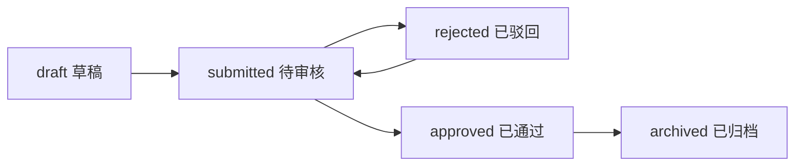

# 生长采集记录审核链路

## 1. 模块说明

生长采集记录用于保存本草标本馆现场采集的药材生长环境、形态指标、现场图片和审核轨迹。本次闭环只覆盖“生长采集记录 / 采集数据”，不包含申报、评价、业绩认定、批次审核、识别复核、公开溯源页或二维码。

## 2. 审核状态

| 状态 | 含义 | 说明 |
| --- | --- | --- |
| `draft` | 草稿 | 采集员创建后默认状态，可编辑、可删除、可提交 |
| `submitted` | 待审核 | 已提交审核，禁止普通编辑 |
| `approved` | 已通过 | 审核通过，等待管理员归档，禁止普通编辑 |
| `rejected` | 已驳回 | 审核驳回，采集员可修改后重新提交 |
| `archived` | 已归档 | 管理员归档后禁止普通编辑、删除、重新提交和审核 |

## 3. 状态流转

允许流转：



禁止流转由后端 Service 统一校验，包括 `draft -> approved`、`draft -> archived`、`rejected -> approved`、`rejected -> archived`、`submitted -> archived`、`archived -> 任意状态`。

## 4. 角色权限

| 角色 | 能力 |
| --- | --- |
| `COLLECTOR` | 创建自己的采集记录；编辑自己的 `draft/rejected`；提交自己的 `draft/rejected`；查看自己的审核历史和溯源事件 |
| `REVIEWER` | 查看待审核记录；对 `submitted` 记录审核通过或驳回；查看权限范围内审核历史和溯源事件 |
| `ADMIN` | 查看全部记录；归档 `approved` 记录；查看全部审核历史和溯源事件 |

操作人信息从 JWT 当前用户上下文读取，前端传入的用户 ID 不作为可信操作人。

## 5. 后端接口

基础路径为 `/api`。

| 方法 | 路径 | 说明 |
| --- | --- | --- |
| `GET` | `/growth-records` | 查询生长采集记录列表 |
| `GET` | `/growth-records/review/page` | 查询待审核记录，默认 `reviewStatus=submitted` |
| `GET` | `/growth-records/{id}` | 查询详情 |
| `POST` | `/growth-records` | 创建采集记录，默认 `draft` |
| `PUT` | `/growth-records/{id}` | 修改 `draft/rejected` 记录 |
| `PUT` | `/growth-records/{id}/submit` | 提交审核，支持 `draft/rejected -> submitted` |
| `PUT` | `/growth-records/{id}/approve` | 审核通过，仅支持 `submitted -> approved` |
| `PUT` | `/growth-records/{id}/reject` | 审核驳回，仅支持 `submitted -> rejected`，`comment` 必填 |
| `PUT` | `/growth-records/{id}/archive` | 管理员归档，仅支持 `approved -> archived` |
| `GET` | `/growth-records/{id}/audit-history` | 查询审核历史 |
| `GET` | `/growth-records/{id}/trace-events` | 查询溯源事件 |

兼容旧接口：`POST /growth-records/{id}/submissions`、`POST /growth-records/{id}/audit-records`、`POST /growth-records/{id}/archives` 仍保留。

## 6. 审核历史

审核历史复用 `herb_growth_review_record`，记录提交、重新提交、通过、驳回和归档动作。

返回字段：

- `actionType`
- `beforeStatus`
- `afterStatus`
- `operatorId`
- `operatorName`
- `operatorRole`
- `comment`
- `operateTime`

动作类型：

- `submit`
- `resubmit`
- `approve`
- `reject`
- `archive`

## 7. 溯源事件

溯源事件写入 `herb_growth_trace_event`，覆盖创建、修改、提交、重新提交、通过、驳回、归档。

返回字段：

- `eventType`
- `eventTitle`
- `eventContent`
- `beforeStatus`
- `afterStatus`
- `operatorName`
- `operatorRole`
- `eventTime`
- `remark`
- `metadataJson`

事件类型：

- `created`
- `updated`
- `submitted`
- `resubmitted`
- `approved`
- `rejected`
- `archived`

修改记录时，`metadataJson` 只保存字段摘要，例如“修改了备注”“修改了温度”，不保存图片 Base64 或完整大字段。

## 8. Web 端操作流程

在生长数据页面：

1. 采集员创建记录后看到状态为草稿。
2. `draft/rejected` 状态显示“提交审核”。
3. 审核员在状态筛选中查看 `submitted` 记录，进入详情后可“审核通过”或“审核驳回”。
4. 驳回弹窗必须填写驳回原因。
5. 管理员对 `approved` 记录进入详情后可归档。
6. 详情页展示当前状态、审核历史和溯源时间线。
7. 操作成功后刷新列表、详情、审核历史和溯源事件。

## 9. 移动端展示说明

当前 uni-app 目录未发现独立生长记录模块，本次不强行新增审核员工作台或复杂归档页面。若后续接入移动端生长记录详情，应至少展示审核状态和驳回意见，并限制 `submitted/approved/archived` 状态继续随意修改。

## 10. 测试流程

后端 Service 单测：

```powershell
mvn -q "-Dtest=com.bdis.modules.growth.service.GrowthRecordServiceImplTest" test
```

接口联调脚本：

```powershell
.\scripts\test-growth-audit-chain.ps1 `
  -BaseUrl "http://localhost:8080/api" `
  -CollectorUsername "collector" `
  -CollectorPassword "password" `
  -ReviewerUsername "reviewer" `
  -ReviewerPassword "password" `
  -AdminUsername "admin" `
  -AdminPassword "password"
```

脚本流程覆盖：

1. 创建记录。
2. 提交审核。
3. 查询审核历史和溯源事件。
4. 审核驳回。
5. 修改记录。
6. 重新提交。
7. 审核通过。
8. 管理员归档。
9. 再次查询审核历史和溯源事件。
10. 尝试修改归档记录并确认失败。

## 11. 注意事项

- 所有状态流转必须走 `GrowthRecordService`，不能只在 Controller 改状态。
- 状态更新、审核历史、溯源事件在同一事务内完成。
- `archived` 禁止普通修改、删除、重新提交和审核。
- 驳回必须填写 `comment`。
- `trace-events` 按事件时间正序返回。
- 前端按钮只是体验控制，非法流转以后端校验为准。
