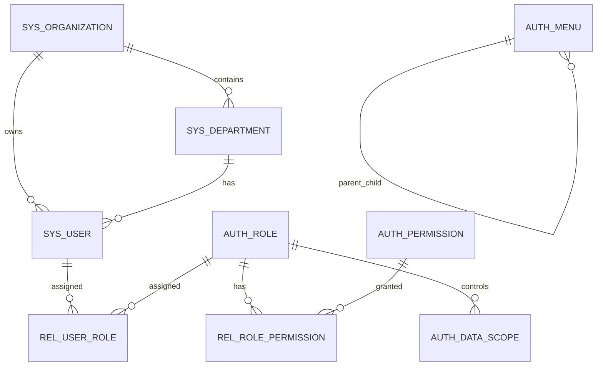
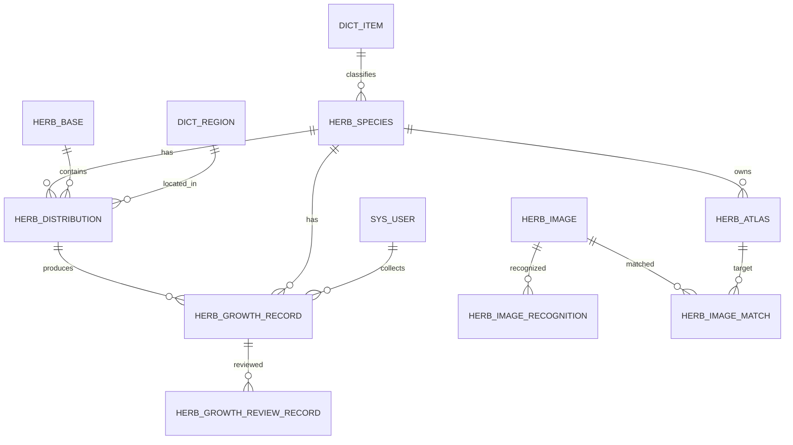
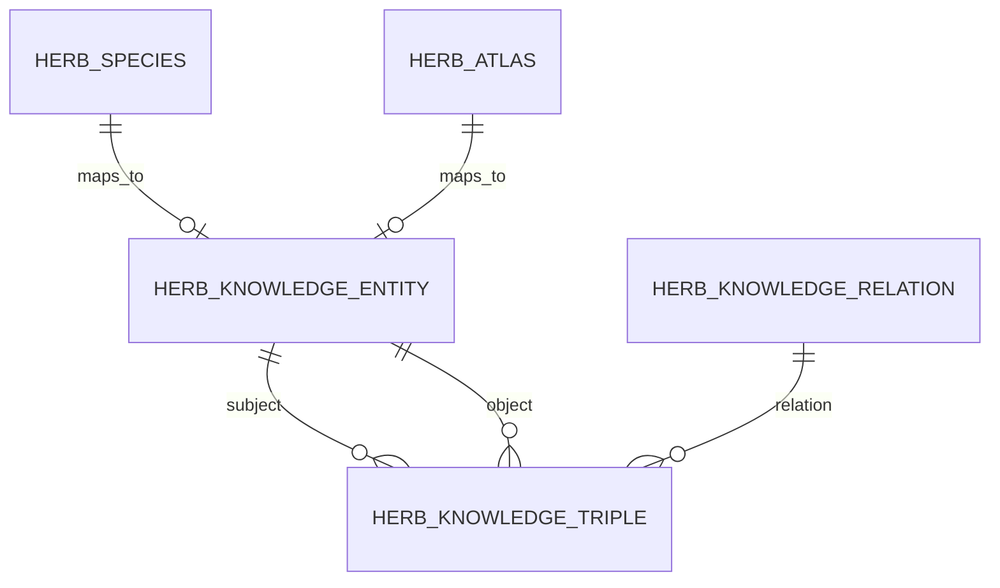
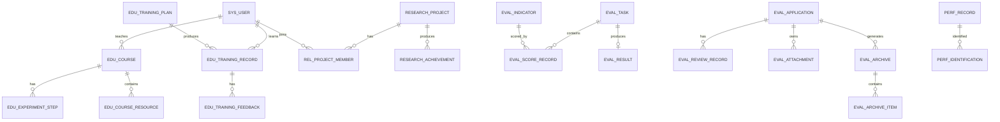

# 生物医药数字信息系统数据库设计说明书

> 版本：V1.0  
> 日期：2026-07-08  
> 数据库：MySQL 8.x  
> 存储引擎：InnoDB  
> 字符集：utf8mb4  
> 技术栈：Spring Boot + Vue + MyBatis  
> 设计范围：用户权限、中药材资源、地图分布、生长采集、文件资源、图谱知识、AI 图像识别、教学科研、评价申报、业绩认定、SOAP 数据交换、日志审计、首页看板。

---

## 1. 设计目标

本数据库设计用于支撑“生物医药数字信息系统”的完整功能建设。设计目标如下：

1. 支撑用户、角色、权限、组织、数据范围和审计追踪等基础能力。
2. 支撑中药材主数据、地图分布、生长采集、移动端采集、图片上传等核心业务。
3. 支撑标准图谱、AI 图像识别、图谱比对、知识图谱关系展示等创新功能。
4. 支撑实验课程、课题研究、实验记录、培训过程、评价管理、申报档案和业绩认定等教学科研管理流程。
5. 支撑 SOAP 模拟数据交换、APP 上传、批量导入和同步日志记录。
6. 允许初版系统只实现核心功能，扩展功能对应表可先创建为空表，后续迭代直接复用。

---

## 2. 命名与设计约定

| 对象 | 规范 |
|---|---|
| 数据库名 | `biomed_dev`、`biomed_test`、`biomed_prod` |
| 表名 | 小写英文 + 下划线，格式为“模块前缀_业务对象” |
| 字段名 | 小写英文 + 下划线 |
| 主键 | 统一命名为 `id`，类型为 `BIGINT` |
| 业务编号 | 使用 `xxx_no`，例如 `herb_no`、`course_no`、`application_no` |
| 时间字段 | 统一使用 `created_at`、`updated_at`、`submitted_at` 等 |
| 审计字段 | 统一使用 `created_by`、`updated_by`、`deleted_by` |
| 逻辑删除 | 统一使用 `is_deleted`，0 未删除，1 已删除 |
| 普通索引 | `idx_表名_字段名` |
| 唯一索引 | `uk_表名_字段名` |
| 主键约束 | `pk_表名` |
| 外键约束 | `fk_当前表_关联表` |

### 2.1 表名前缀

| 前缀 | 含义 |
|---|---|
| `sys_` | 系统基础表 |
| `auth_` | 权限认证表 |
| `rel_` | 关系中间表 |
| `dict_` | 数据字典表 |
| `herb_` | 中药材资源、图谱、采集、识别相关表 |
| `edu_` | 教学、实验、培训相关表 |
| `research_` | 科研课题和成果相关表 |
| `eval_` | 评价和申报相关表 |
| `perf_` | 业绩认定相关表 |
| `soap_` | SOAP 数据交换相关表 |
| `log_` | 日志审计相关表 |
| `stat_` | 统计分析相关表 |

### 2.2 外键策略

本设计同时给出逻辑外键关系。实际建库时建议：

1. 核心配置表、关系表可以创建物理外键。
2. 日志表、大数据量采集表、图谱三元组表可只保留逻辑外键。
3. 多态来源字段，如 `source_type + source_id`、`biz_type + biz_id`，不创建物理外键，由业务层保证一致性。

---

## 3. 通用字段组设计

### 3.1 完整审计字段组 `full`

`id BIGINT PK AUTO_INCREMENT`，`status TINYINT DEFAULT 1`，`is_deleted TINYINT DEFAULT 0`，`created_at DATETIME DEFAULT CURRENT_TIMESTAMP`，`updated_at DATETIME DEFAULT CURRENT_TIMESTAMP ON UPDATE CURRENT_TIMESTAMP`，`created_by BIGINT NULL`，`updated_by BIGINT NULL`，`deleted_at DATETIME NULL`，`deleted_by BIGINT NULL`，`remark VARCHAR(500) NULL`，`version INT DEFAULT 0`。

### 3.2 基础字段组 `basic`

`id BIGINT PK AUTO_INCREMENT`，`created_at DATETIME DEFAULT CURRENT_TIMESTAMP`，`updated_at DATETIME DEFAULT CURRENT_TIMESTAMP ON UPDATE CURRENT_TIMESTAMP`，`remark VARCHAR(500) NULL`。

### 3.3 关系字段组 `relation`

`id BIGINT PK AUTO_INCREMENT`，`created_at DATETIME DEFAULT CURRENT_TIMESTAMP`，`created_by BIGINT NULL`，`remark VARCHAR(500) NULL`。

### 3.4 日志字段组 `log`

`id BIGINT PK AUTO_INCREMENT`，`created_at DATETIME DEFAULT CURRENT_TIMESTAMP`。

---

## 4. 数据库表清单

| 序号 | 表名 | 中文名 | 对应模块 | 优先级/状态 |
| --- | --- | --- | --- | --- |
| 1 | sys_organization | 机构表 | M02 用户角色模块 | P0 |
| 2 | sys_department | 部门表 | M02 用户角色模块 | P0 |
| 3 | sys_user | 用户表 | M01 身份认证模块 / M02 用户角色模块 | P0 |
| 4 | auth_role | 角色表 | M02 用户角色模块 / M03 权限控制模块 | P0 |
| 5 | auth_menu | 菜单表 | M03 权限控制模块 | P0 |
| 6 | auth_permission | 权限表 | M03 权限控制模块 | P0 |
| 7 | rel_user_role | 用户角色关系表 | M02 用户角色模块 | P0 |
| 8 | rel_role_permission | 角色权限关系表 | M03 权限控制模块 | P0 |
| 9 | auth_data_scope | 数据范围权限表 | M03 权限控制模块 | P0 预留 |
| 10 | dict_type | 字典类型表 | M04 数据字典模块 | P0 |
| 11 | dict_item | 字典项表 | M04 数据字典模块 | P0 |
| 12 | dict_region | 区域字典表 | M04 数据字典模块 / M08 基地与地图模块 | P0 |
| 13 | sys_file_resource | 文件资源表 | M05 文件资源模块 | P0 预留 |
| 14 | sys_file_business | 文件业务关联表 | M05 文件资源模块 | P0 预留 |
| 15 | log_login | 登录日志表 | M01 身份认证模块 / M06 操作审计模块 | P0 |
| 16 | log_operation | 操作日志表 | M06 操作审计模块 | P0 |
| 17 | log_data_change | 数据变更日志表 | M06 操作审计模块 | P1 |
| 18 | log_file_access | 文件访问日志表 | M05 文件资源模块 / M06 操作审计模块 | P0 预留 |
| 19 | log_data_sync | 数据同步日志表 | M19 SOAP 数据交换模块 / M06 操作审计模块 | P1 |
| 20 | herb_species | 中药材品种基础信息表 | M07 药材档案模块 | P0 |
| 21 | herb_base | 中药材基地表 | M08 基地与地图模块 | P0 预留 |
| 22 | herb_distribution | 中药材地图分布点表 | M08 基地与地图模块 | P0 |
| 23 | herb_growth_record | 中药材生长采集记录表 | M09 生长采集模块 | P0 |
| 24 | herb_growth_review_record | 采集审核记录表 | M10 采集审核与溯源模块 | P0 预留 |
| 25 | herb_ai_model_version | AI 模型版本表 | M11 图谱知识模块 | P1 |
| 26 | herb_atlas | 中药材标准图谱表 | M11 图谱知识模块 | P1 |
| 27 | herb_atlas_tag | 标准图谱标签表 | M11 图谱知识模块 | P1 |
| 28 | herb_image | 用户上传/采集中药材图片表 | M05 文件资源模块 / M09 生长采集模块 / M11 图谱知识模块 | P0 |
| 29 | herb_image_recognition | 用户图片 AI 识别结果表 | M11 图谱知识模块 | P1 |
| 30 | herb_image_match | 用户图片与标准图谱比对结果表 | M11 图谱知识模块 | P1 |
| 31 | herb_knowledge_entity | 中药材知识图谱实体表 | M11 图谱知识模块 | P1 |
| 32 | herb_knowledge_relation | 中药材知识图谱关系类型表 | M11 图谱知识模块 | P1 |
| 33 | herb_knowledge_triple | 中药材知识图谱三元组表 | M11 图谱知识模块 | P1 |
| 34 | edu_course | 实验课程表 | M12 实验课程模块 | P0 |
| 35 | edu_experiment_step | 实验步骤表 | M12 实验课程模块 | P0 预留 |
| 36 | edu_course_resource | 教学课程资源表 | M12 实验课程模块 / M05 文件资源模块 | P0 |
| 37 | edu_training_plan | 培训计划表 | M15 培训过程模块 | P1 预留 |
| 38 | edu_training_record | 培训参与记录表 | M15 培训过程模块 | P1 |
| 39 | edu_training_feedback | 培训反馈表 | M15 培训过程模块 | P1 预留 |
| 40 | edu_experiment_record | 实验记录表 | M14 实验记录模块 | P1 预留 |
| 41 | research_project | 科研课题表 | M13 课题研究模块 | P1 |
| 42 | rel_project_member | 课题成员关系表 | M13 课题研究模块 | P1 |
| 43 | research_achievement | 科研成果表 | M13 课题研究模块 / M18 业绩认定模块 | P1 |
| 44 | eval_indicator | 评价指标表 | M16 评价管理模块 | P1 预留 |
| 45 | eval_task | 评价任务表 | M16 评价管理模块 | P1 预留 |
| 46 | eval_score_record | 评价评分记录表 | M16 评价管理模块 | P1 预留 |
| 47 | eval_result | 评价结果表 | M16 评价管理模块 | P1 预留 |
| 48 | eval_application | 评价申报表 | M17 申报档案模块 | P1 |
| 49 | eval_review_record | 申报审核记录表 | M17 申报档案模块 | P1 |
| 50 | eval_attachment | 申报附件表 | M17 申报档案模块 / M05 文件资源模块 | P1 |
| 51 | eval_archive | 申报档案袋表 | M17 申报档案模块 | P1 预留 |
| 52 | eval_archive_item | 申报档案材料项表 | M17 申报档案模块 | P1 预留 |
| 53 | perf_standard | 业绩认定标准表 | M18 业绩认定模块 | P1 预留 |
| 54 | perf_record | 业绩记录表 | M18 业绩认定模块 | P1 |
| 55 | perf_identification | 业绩认定记录表 | M18 业绩认定模块 | P1 |
| 56 | soap_sync_task | SOAP 同步任务表 | M19 SOAP 数据交换模块 | P1 |
| 57 | soap_exchange_record | SOAP 交换记录表 | M19 SOAP 数据交换模块 | P1 |
| 58 | stat_dashboard_snapshot | 首页看板统计快照表 | M20 首页看板模块 | P0 可选预留 |
---

## 5. 核心关系图

### 5.1 基础权限关系图



### 5.2 中药材核心数据关系图



### 5.3 知识图谱关系图



### 5.4 教学科研、评价申报与业绩关系图



---

## 6. 详细表结构设计

### 6.1 `sys_organization`：机构表

- **对应模块**：M02 用户角色模块
- **优先级/状态**：P0
- **表说明**：保存学校、学院、实验室、合作基地等机构信息。
- **通用字段组**：`full`，`id BIGINT PK AUTO_INCREMENT`，`status TINYINT DEFAULT 1`，`is_deleted TINYINT DEFAULT 0`，`created_at DATETIME DEFAULT CURRENT_TIMESTAMP`，`updated_at DATETIME DEFAULT CURRENT_TIMESTAMP ON UPDATE CURRENT_TIMESTAMP`，`created_by BIGINT NULL`，`updated_by BIGINT NULL`，`deleted_at DATETIME NULL`，`deleted_by BIGINT NULL`，`remark VARCHAR(500) NULL`，`version INT DEFAULT 0`。

**业务字段设计：**

| 字段名 | 数据类型 | 是否必填 | 默认值 | 键/索引 | 字段说明 |
| --- | --- | --- | --- | --- | --- |
| organization_no | VARCHAR(64) | 是 | NULL | UK | 机构编号 |
| organization_name | VARCHAR(100) | 是 | NULL | IDX | 机构名称 |
| organization_type | VARCHAR(50) | 否 | NULL | IDX | 机构类型：school、college、lab、base |
| contact_name | VARCHAR(50) | 否 | NULL |  | 联系人 |
| contact_phone | VARCHAR(30) | 否 | NULL |  | 联系电话 |
| address | VARCHAR(255) | 否 | NULL |  | 地址 |

**主键：** `id`

**唯一约束 / 唯一索引：** uk_sys_organization_organization_no(organization_no)

**普通索引：** idx_sys_organization_name(organization_name), idx_sys_organization_status(status)

**逻辑外键关系：** 无


### 6.2 `sys_department`：部门表

- **对应模块**：M02 用户角色模块
- **优先级/状态**：P0
- **表说明**：保存部门、教研室、实验室、小组等组织结构。
- **通用字段组**：`full`，`id BIGINT PK AUTO_INCREMENT`，`status TINYINT DEFAULT 1`，`is_deleted TINYINT DEFAULT 0`，`created_at DATETIME DEFAULT CURRENT_TIMESTAMP`，`updated_at DATETIME DEFAULT CURRENT_TIMESTAMP ON UPDATE CURRENT_TIMESTAMP`，`created_by BIGINT NULL`，`updated_by BIGINT NULL`，`deleted_at DATETIME NULL`，`deleted_by BIGINT NULL`，`remark VARCHAR(500) NULL`，`version INT DEFAULT 0`。

**业务字段设计：**

| 字段名 | 数据类型 | 是否必填 | 默认值 | 键/索引 | 字段说明 |
| --- | --- | --- | --- | --- | --- |
| department_no | VARCHAR(64) | 是 | NULL | UK | 部门编号 |
| department_name | VARCHAR(100) | 是 | NULL | IDX | 部门名称 |
| organization_id | BIGINT | 是 | NULL | FK/IDX | 所属机构 ID |
| parent_id | BIGINT | 否 | 0 | FK/IDX | 父级部门 ID |
| sort_order | INT | 否 | 0 |  | 排序号 |

**主键：** `id`

**唯一约束 / 唯一索引：** uk_sys_department_department_no(department_no)

**普通索引：** idx_sys_department_organization_id(organization_id), idx_sys_department_parent_id(parent_id)

**逻辑外键关系：** organization_id -> sys_organization.id; parent_id -> sys_department.id


### 6.3 `sys_user`：用户表

- **对应模块**：M01 身份认证模块 / M02 用户角色模块
- **优先级/状态**：P0
- **表说明**：保存系统用户，用于登录、采集、审核、上传、申报和审计。
- **通用字段组**：`full`，`id BIGINT PK AUTO_INCREMENT`，`status TINYINT DEFAULT 1`，`is_deleted TINYINT DEFAULT 0`，`created_at DATETIME DEFAULT CURRENT_TIMESTAMP`，`updated_at DATETIME DEFAULT CURRENT_TIMESTAMP ON UPDATE CURRENT_TIMESTAMP`，`created_by BIGINT NULL`，`updated_by BIGINT NULL`，`deleted_at DATETIME NULL`，`deleted_by BIGINT NULL`，`remark VARCHAR(500) NULL`，`version INT DEFAULT 0`。

**业务字段设计：**

| 字段名 | 数据类型 | 是否必填 | 默认值 | 键/索引 | 字段说明 |
| --- | --- | --- | --- | --- | --- |
| user_no | VARCHAR(64) | 是 | NULL | UK | 用户编号 |
| username | VARCHAR(64) | 是 | NULL | UK | 登录账号 |
| password_hash | VARCHAR(255) | 是 | NULL |  | 密码哈希 |
| real_name | VARCHAR(50) | 否 | NULL | IDX | 真实姓名 |
| phone_number | VARCHAR(30) | 否 | NULL | IDX | 手机号 |
| email | VARCHAR(100) | 否 | NULL |  | 邮箱 |
| organization_id | BIGINT | 否 | NULL | FK/IDX | 所属机构 ID |
| department_id | BIGINT | 否 | NULL | FK/IDX | 所属部门 ID |
| user_type | VARCHAR(50) | 否 | NULL | IDX | 用户类型：admin、teacher、student、collector、reviewer |
| avatar_url | VARCHAR(500) | 否 | NULL |  | 头像地址 |
| last_login_at | DATETIME | 否 | NULL |  | 最后登录时间 |

**主键：** `id`

**唯一约束 / 唯一索引：** uk_sys_user_user_no(user_no), uk_sys_user_username(username)

**普通索引：** idx_sys_user_department_id(department_id), idx_sys_user_organization_id(organization_id), idx_sys_user_status(status)

**逻辑外键关系：** organization_id -> sys_organization.id; department_id -> sys_department.id


### 6.4 `auth_role`：角色表

- **对应模块**：M02 用户角色模块 / M03 权限控制模块
- **优先级/状态**：P0
- **表说明**：保存系统角色定义。
- **通用字段组**：`full`，`id BIGINT PK AUTO_INCREMENT`，`status TINYINT DEFAULT 1`，`is_deleted TINYINT DEFAULT 0`，`created_at DATETIME DEFAULT CURRENT_TIMESTAMP`，`updated_at DATETIME DEFAULT CURRENT_TIMESTAMP ON UPDATE CURRENT_TIMESTAMP`，`created_by BIGINT NULL`，`updated_by BIGINT NULL`，`deleted_at DATETIME NULL`，`deleted_by BIGINT NULL`，`remark VARCHAR(500) NULL`，`version INT DEFAULT 0`。

**业务字段设计：**

| 字段名 | 数据类型 | 是否必填 | 默认值 | 键/索引 | 字段说明 |
| --- | --- | --- | --- | --- | --- |
| role_code | VARCHAR(64) | 是 | NULL | UK | 角色编码 |
| role_name | VARCHAR(100) | 是 | NULL | IDX | 角色名称 |
| role_type | VARCHAR(50) | 否 | NULL |  | 角色类型 |
| data_scope | VARCHAR(50) | 否 | NULL | IDX | 简化数据范围：all、organization、department、self、custom |
| description | VARCHAR(255) | 否 | NULL |  | 角色说明 |
| sort_order | INT | 否 | 0 |  | 排序号 |

**主键：** `id`

**唯一约束 / 唯一索引：** uk_auth_role_role_code(role_code)

**普通索引：** idx_auth_role_status(status), idx_auth_role_data_scope(data_scope)

**逻辑外键关系：** 无


### 6.5 `auth_menu`：菜单表

- **对应模块**：M03 权限控制模块
- **优先级/状态**：P0
- **表说明**：保存前端菜单、路由和组件路径，支持树形菜单。
- **通用字段组**：`full`，`id BIGINT PK AUTO_INCREMENT`，`status TINYINT DEFAULT 1`，`is_deleted TINYINT DEFAULT 0`，`created_at DATETIME DEFAULT CURRENT_TIMESTAMP`，`updated_at DATETIME DEFAULT CURRENT_TIMESTAMP ON UPDATE CURRENT_TIMESTAMP`，`created_by BIGINT NULL`，`updated_by BIGINT NULL`，`deleted_at DATETIME NULL`，`deleted_by BIGINT NULL`，`remark VARCHAR(500) NULL`，`version INT DEFAULT 0`。

**业务字段设计：**

| 字段名 | 数据类型 | 是否必填 | 默认值 | 键/索引 | 字段说明 |
| --- | --- | --- | --- | --- | --- |
| parent_id | BIGINT | 否 | 0 | FK/IDX | 父菜单 ID |
| menu_code | VARCHAR(100) | 是 | NULL | UK | 菜单编码 |
| menu_name | VARCHAR(100) | 是 | NULL | IDX | 菜单名称 |
| route_path | VARCHAR(255) | 否 | NULL |  | 前端路由 |
| component_path | VARCHAR(255) | 否 | NULL |  | 组件路径 |
| icon | VARCHAR(100) | 否 | NULL |  | 图标 |
| visible | TINYINT | 否 | 1 |  | 是否显示：0 否，1 是 |
| sort_order | INT | 否 | 0 |  | 排序号 |

**主键：** `id`

**唯一约束 / 唯一索引：** uk_auth_menu_menu_code(menu_code)

**普通索引：** idx_auth_menu_parent_id(parent_id), idx_auth_menu_status(status)

**逻辑外键关系：** parent_id -> auth_menu.id


### 6.6 `auth_permission`：权限表

- **对应模块**：M03 权限控制模块
- **优先级/状态**：P0
- **表说明**：保存菜单、按钮、接口等权限点。
- **通用字段组**：`full`，`id BIGINT PK AUTO_INCREMENT`，`status TINYINT DEFAULT 1`，`is_deleted TINYINT DEFAULT 0`，`created_at DATETIME DEFAULT CURRENT_TIMESTAMP`，`updated_at DATETIME DEFAULT CURRENT_TIMESTAMP ON UPDATE CURRENT_TIMESTAMP`，`created_by BIGINT NULL`，`updated_by BIGINT NULL`，`deleted_at DATETIME NULL`，`deleted_by BIGINT NULL`，`remark VARCHAR(500) NULL`，`version INT DEFAULT 0`。

**业务字段设计：**

| 字段名 | 数据类型 | 是否必填 | 默认值 | 键/索引 | 字段说明 |
| --- | --- | --- | --- | --- | --- |
| permission_code | VARCHAR(100) | 是 | NULL | UK | 权限编码，如 herb:species:add |
| permission_name | VARCHAR(100) | 是 | NULL |  | 权限名称 |
| permission_type | VARCHAR(50) | 是 | NULL | IDX | 权限类型：menu、button、api |
| menu_id | BIGINT | 否 | NULL | FK/IDX | 所属菜单 ID |
| api_path | VARCHAR(255) | 否 | NULL | IDX | 接口路径 |
| request_method | VARCHAR(20) | 否 | NULL |  | 请求方法 |
| description | VARCHAR(255) | 否 | NULL |  | 权限说明 |

**主键：** `id`

**唯一约束 / 唯一索引：** uk_auth_permission_permission_code(permission_code)

**普通索引：** idx_auth_permission_menu_id(menu_id), idx_auth_permission_api_path(api_path), idx_auth_permission_type(permission_type)

**逻辑外键关系：** menu_id -> auth_menu.id


### 6.7 `rel_user_role`：用户角色关系表

- **对应模块**：M02 用户角色模块
- **优先级/状态**：P0
- **表说明**：用户与角色多对多关系。
- **通用字段组**：`relation`，`id BIGINT PK AUTO_INCREMENT`，`created_at DATETIME DEFAULT CURRENT_TIMESTAMP`，`created_by BIGINT NULL`，`remark VARCHAR(500) NULL`。

**业务字段设计：**

| 字段名 | 数据类型 | 是否必填 | 默认值 | 键/索引 | 字段说明 |
| --- | --- | --- | --- | --- | --- |
| user_id | BIGINT | 是 | NULL | FK/IDX | 用户 ID |
| role_id | BIGINT | 是 | NULL | FK/IDX | 角色 ID |

**主键：** `id`

**唯一约束 / 唯一索引：** uk_rel_user_role_user_id_role_id(user_id, role_id)

**普通索引：** idx_rel_user_role_user_id(user_id), idx_rel_user_role_role_id(role_id)

**逻辑外键关系：** user_id -> sys_user.id; role_id -> auth_role.id


### 6.8 `rel_role_permission`：角色权限关系表

- **对应模块**：M03 权限控制模块
- **优先级/状态**：P0
- **表说明**：角色与权限多对多关系。
- **通用字段组**：`relation`，`id BIGINT PK AUTO_INCREMENT`，`created_at DATETIME DEFAULT CURRENT_TIMESTAMP`，`created_by BIGINT NULL`，`remark VARCHAR(500) NULL`。

**业务字段设计：**

| 字段名 | 数据类型 | 是否必填 | 默认值 | 键/索引 | 字段说明 |
| --- | --- | --- | --- | --- | --- |
| role_id | BIGINT | 是 | NULL | FK/IDX | 角色 ID |
| permission_id | BIGINT | 是 | NULL | FK/IDX | 权限 ID |

**主键：** `id`

**唯一约束 / 唯一索引：** uk_rel_role_permission_role_id_permission_id(role_id, permission_id)

**普通索引：** idx_rel_role_permission_role_id(role_id), idx_rel_role_permission_permission_id(permission_id)

**逻辑外键关系：** role_id -> auth_role.id; permission_id -> auth_permission.id


### 6.9 `auth_data_scope`：数据范围权限表

- **对应模块**：M03 权限控制模块
- **优先级/状态**：P0 预留
- **表说明**：保存角色在不同业务资源上的数据可见范围。
- **通用字段组**：`full`，`id BIGINT PK AUTO_INCREMENT`，`status TINYINT DEFAULT 1`，`is_deleted TINYINT DEFAULT 0`，`created_at DATETIME DEFAULT CURRENT_TIMESTAMP`，`updated_at DATETIME DEFAULT CURRENT_TIMESTAMP ON UPDATE CURRENT_TIMESTAMP`，`created_by BIGINT NULL`，`updated_by BIGINT NULL`，`deleted_at DATETIME NULL`，`deleted_by BIGINT NULL`，`remark VARCHAR(500) NULL`，`version INT DEFAULT 0`。

**业务字段设计：**

| 字段名 | 数据类型 | 是否必填 | 默认值 | 键/索引 | 字段说明 |
| --- | --- | --- | --- | --- | --- |
| role_id | BIGINT | 是 | NULL | FK/IDX | 角色 ID |
| resource_type | VARCHAR(100) | 是 | NULL | IDX | 资源类型，如 herb_growth_record、eval_application |
| scope_type | VARCHAR(50) | 是 | NULL | IDX | 范围类型：all、organization、department、self、custom |
| organization_id | BIGINT | 否 | NULL | FK/IDX | 机构 ID |
| department_id | BIGINT | 否 | NULL | FK/IDX | 部门 ID |
| custom_rule | TEXT | 否 | NULL |  | 自定义规则 JSON |

**主键：** `id`

**唯一约束 / 唯一索引：** uk_auth_data_scope_role_resource(role_id, resource_type)

**普通索引：** idx_auth_data_scope_scope_type(scope_type)

**逻辑外键关系：** role_id -> auth_role.id; organization_id -> sys_organization.id; department_id -> sys_department.id


### 6.10 `dict_type`：字典类型表

- **对应模块**：M04 数据字典模块
- **优先级/状态**：P0
- **表说明**：保存字典分类，如 herb_category、growth_stage、review_status。
- **通用字段组**：`full`，`id BIGINT PK AUTO_INCREMENT`，`status TINYINT DEFAULT 1`，`is_deleted TINYINT DEFAULT 0`，`created_at DATETIME DEFAULT CURRENT_TIMESTAMP`，`updated_at DATETIME DEFAULT CURRENT_TIMESTAMP ON UPDATE CURRENT_TIMESTAMP`，`created_by BIGINT NULL`，`updated_by BIGINT NULL`，`deleted_at DATETIME NULL`，`deleted_by BIGINT NULL`，`remark VARCHAR(500) NULL`，`version INT DEFAULT 0`。

**业务字段设计：**

| 字段名 | 数据类型 | 是否必填 | 默认值 | 键/索引 | 字段说明 |
| --- | --- | --- | --- | --- | --- |
| type_code | VARCHAR(64) | 是 | NULL | UK | 字典类型编码 |
| type_name | VARCHAR(100) | 是 | NULL |  | 字典类型名称 |
| sort_order | INT | 否 | 0 |  | 排序号 |

**主键：** `id`

**唯一约束 / 唯一索引：** uk_dict_type_type_code(type_code)

**普通索引：** idx_dict_type_status(status)

**逻辑外键关系：** 无


### 6.11 `dict_item`：字典项表

- **对应模块**：M04 数据字典模块
- **优先级/状态**：P0
- **表说明**：保存具体字典项。
- **通用字段组**：`full`，`id BIGINT PK AUTO_INCREMENT`，`status TINYINT DEFAULT 1`，`is_deleted TINYINT DEFAULT 0`，`created_at DATETIME DEFAULT CURRENT_TIMESTAMP`，`updated_at DATETIME DEFAULT CURRENT_TIMESTAMP ON UPDATE CURRENT_TIMESTAMP`，`created_by BIGINT NULL`，`updated_by BIGINT NULL`，`deleted_at DATETIME NULL`，`deleted_by BIGINT NULL`，`remark VARCHAR(500) NULL`，`version INT DEFAULT 0`。

**业务字段设计：**

| 字段名 | 数据类型 | 是否必填 | 默认值 | 键/索引 | 字段说明 |
| --- | --- | --- | --- | --- | --- |
| type_id | BIGINT | 是 | NULL | FK/IDX | 字典类型 ID |
| item_code | VARCHAR(64) | 是 | NULL | IDX | 字典项编码 |
| item_name | VARCHAR(100) | 是 | NULL |  | 字典项名称 |
| item_value | VARCHAR(100) | 否 | NULL |  | 字典项值 |
| parent_id | BIGINT | 否 | 0 | FK/IDX | 父字典项 ID |
| sort_order | INT | 否 | 0 |  | 排序号 |

**主键：** `id`

**唯一约束 / 唯一索引：** uk_dict_item_type_id_item_code(type_id, item_code)

**普通索引：** idx_dict_item_type_id(type_id), idx_dict_item_parent_id(parent_id)

**逻辑外键关系：** type_id -> dict_type.id; parent_id -> dict_item.id


### 6.12 `dict_region`：区域字典表

- **对应模块**：M04 数据字典模块 / M08 基地与地图模块
- **优先级/状态**：P0
- **表说明**：保存省、市、区县、乡镇、基地区域等地理层级。
- **通用字段组**：`full`，`id BIGINT PK AUTO_INCREMENT`，`status TINYINT DEFAULT 1`，`is_deleted TINYINT DEFAULT 0`，`created_at DATETIME DEFAULT CURRENT_TIMESTAMP`，`updated_at DATETIME DEFAULT CURRENT_TIMESTAMP ON UPDATE CURRENT_TIMESTAMP`，`created_by BIGINT NULL`，`updated_by BIGINT NULL`，`deleted_at DATETIME NULL`，`deleted_by BIGINT NULL`，`remark VARCHAR(500) NULL`，`version INT DEFAULT 0`。

**业务字段设计：**

| 字段名 | 数据类型 | 是否必填 | 默认值 | 键/索引 | 字段说明 |
| --- | --- | --- | --- | --- | --- |
| region_code | VARCHAR(64) | 是 | NULL | UK | 区域编码 |
| region_name | VARCHAR(100) | 是 | NULL | IDX | 区域名称 |
| parent_id | BIGINT | 否 | 0 | FK/IDX | 父级区域 ID |
| region_level | VARCHAR(50) | 否 | NULL | IDX | 区域级别：province、city、district、town、base_area |
| longitude | DECIMAL(10,7) | 否 | NULL |  | 经度 |
| latitude | DECIMAL(10,7) | 否 | NULL |  | 纬度 |
| sort_order | INT | 否 | 0 |  | 排序号 |

**主键：** `id`

**唯一约束 / 唯一索引：** uk_dict_region_region_code(region_code)

**普通索引：** idx_dict_region_parent_id(parent_id), idx_dict_region_level(region_level)

**逻辑外键关系：** parent_id -> dict_region.id


### 6.13 `sys_file_resource`：文件资源表

- **对应模块**：M05 文件资源模块
- **优先级/状态**：P0 预留
- **表说明**：统一保存图片、文档、视频、课件、图谱、申报材料、业绩材料等文件元数据。
- **通用字段组**：`full`，`id BIGINT PK AUTO_INCREMENT`，`status TINYINT DEFAULT 1`，`is_deleted TINYINT DEFAULT 0`，`created_at DATETIME DEFAULT CURRENT_TIMESTAMP`，`updated_at DATETIME DEFAULT CURRENT_TIMESTAMP ON UPDATE CURRENT_TIMESTAMP`，`created_by BIGINT NULL`，`updated_by BIGINT NULL`，`deleted_at DATETIME NULL`，`deleted_by BIGINT NULL`，`remark VARCHAR(500) NULL`，`version INT DEFAULT 0`。

**业务字段设计：**

| 字段名 | 数据类型 | 是否必填 | 默认值 | 键/索引 | 字段说明 |
| --- | --- | --- | --- | --- | --- |
| file_no | VARCHAR(64) | 是 | NULL | UK | 文件编号 |
| file_name | VARCHAR(255) | 是 | NULL | IDX | 文件名称 |
| original_filename | VARCHAR(255) | 否 | NULL |  | 原始文件名 |
| file_type | VARCHAR(50) | 否 | NULL | IDX | 文件类型：image、video、document、atlas、material |
| file_format | VARCHAR(50) | 否 | NULL |  | 文件格式 |
| file_size | BIGINT | 否 | NULL |  | 文件大小 |
| file_url | VARCHAR(500) | 是 | NULL |  | 文件访问地址 |
| thumbnail_url | VARCHAR(500) | 否 | NULL |  | 缩略图地址 |
| storage_type | VARCHAR(50) | 否 | local | IDX | 存储类型：local、oss、cos |
| uploader_id | BIGINT | 否 | NULL | FK/IDX | 上传人 ID |
| uploaded_at | DATETIME | 否 | CURRENT_TIMESTAMP | IDX | 上传时间 |

**主键：** `id`

**唯一约束 / 唯一索引：** uk_sys_file_resource_file_no(file_no)

**普通索引：** idx_sys_file_resource_file_type(file_type), idx_sys_file_resource_uploader_id(uploader_id), idx_sys_file_resource_uploaded_at(uploaded_at)

**逻辑外键关系：** uploader_id -> sys_user.id


### 6.14 `sys_file_business`：文件业务关联表

- **对应模块**：M05 文件资源模块
- **优先级/状态**：P0 预留
- **表说明**：统一维护文件与业务对象的关联。
- **通用字段组**：`relation`，`id BIGINT PK AUTO_INCREMENT`，`created_at DATETIME DEFAULT CURRENT_TIMESTAMP`，`created_by BIGINT NULL`，`remark VARCHAR(500) NULL`。

**业务字段设计：**

| 字段名 | 数据类型 | 是否必填 | 默认值 | 键/索引 | 字段说明 |
| --- | --- | --- | --- | --- | --- |
| file_id | BIGINT | 是 | NULL | FK/IDX | 文件 ID |
| biz_type | VARCHAR(100) | 是 | NULL | IDX | 业务类型，如 herb_species、edu_course、eval_application |
| biz_id | BIGINT | 是 | NULL | IDX | 业务记录 ID |
| file_usage | VARCHAR(50) | 否 | NULL | IDX | 用途：cover、attachment、material、video、atlas |
| sort_order | INT | 否 | 0 |  | 排序号 |

**主键：** `id`

**唯一约束 / 唯一索引：** 无

**普通索引：** idx_sys_file_business_file_id(file_id), idx_sys_file_business_biz(biz_type, biz_id)

**逻辑外键关系：** file_id -> sys_file_resource.id


### 6.15 `log_login`：登录日志表

- **对应模块**：M01 身份认证模块 / M06 操作审计模块
- **优先级/状态**：P0
- **表说明**：记录用户登录结果、失败原因、IP 和客户端信息。
- **通用字段组**：`log`，`id BIGINT PK AUTO_INCREMENT`，`created_at DATETIME DEFAULT CURRENT_TIMESTAMP`。

**业务字段设计：**

| 字段名 | 数据类型 | 是否必填 | 默认值 | 键/索引 | 字段说明 |
| --- | --- | --- | --- | --- | --- |
| user_id | BIGINT | 否 | NULL | FK/IDX | 用户 ID |
| username | VARCHAR(64) | 否 | NULL | IDX | 登录账号 |
| login_result | VARCHAR(50) | 是 | NULL | IDX | 登录结果：success、failed |
| fail_reason | VARCHAR(255) | 否 | NULL |  | 失败原因 |
| ip_address | VARCHAR(64) | 否 | NULL |  | IP 地址 |
| user_agent | VARCHAR(500) | 否 | NULL |  | 客户端信息 |
| logged_in_at | DATETIME | 是 | CURRENT_TIMESTAMP | IDX | 登录时间 |

**主键：** `id`

**唯一约束 / 唯一索引：** 无

**普通索引：** idx_log_login_user_id(user_id), idx_log_login_logged_in_at(logged_in_at)

**逻辑外键关系：** user_id -> sys_user.id


### 6.16 `log_operation`：操作日志表

- **对应模块**：M06 操作审计模块
- **优先级/状态**：P0
- **表说明**：记录后台管理、审核、上传、下载、删除等关键业务操作。
- **通用字段组**：`log`，`id BIGINT PK AUTO_INCREMENT`，`created_at DATETIME DEFAULT CURRENT_TIMESTAMP`。

**业务字段设计：**

| 字段名 | 数据类型 | 是否必填 | 默认值 | 键/索引 | 字段说明 |
| --- | --- | --- | --- | --- | --- |
| trace_id | VARCHAR(100) | 否 | NULL | IDX | 请求追踪 ID |
| operator_id | BIGINT | 否 | NULL | FK/IDX | 操作人 ID |
| operator_name | VARCHAR(100) | 否 | NULL |  | 操作人名称快照 |
| operation_module | VARCHAR(100) | 否 | NULL | IDX | 操作模块 |
| operation_type | VARCHAR(50) | 否 | NULL | IDX | 操作类型 |
| operation_desc | VARCHAR(500) | 否 | NULL |  | 操作描述 |
| request_method | VARCHAR(20) | 否 | NULL |  | 请求方法 |
| request_url | VARCHAR(500) | 否 | NULL |  | 请求地址 |
| request_param | TEXT | 否 | NULL |  | 请求参数，敏感字段脱敏 |
| result_status | VARCHAR(50) | 否 | NULL | IDX | 结果状态 |
| error_message | TEXT | 否 | NULL |  | 错误信息 |
| ip_address | VARCHAR(64) | 否 | NULL |  | IP 地址 |
| user_agent | VARCHAR(500) | 否 | NULL |  | 客户端信息 |
| operation_time | DATETIME | 是 | CURRENT_TIMESTAMP | IDX | 操作时间 |

**主键：** `id`

**唯一约束 / 唯一索引：** 无

**普通索引：** idx_log_operation_operator_id(operator_id), idx_log_operation_module(operation_module), idx_log_operation_time(operation_time)

**逻辑外键关系：** operator_id -> sys_user.id


### 6.17 `log_data_change`：数据变更日志表

- **对应模块**：M06 操作审计模块
- **优先级/状态**：P1
- **表说明**：记录重要业务表数据修改前后内容。
- **通用字段组**：`log`，`id BIGINT PK AUTO_INCREMENT`，`created_at DATETIME DEFAULT CURRENT_TIMESTAMP`。

**业务字段设计：**

| 字段名 | 数据类型 | 是否必填 | 默认值 | 键/索引 | 字段说明 |
| --- | --- | --- | --- | --- | --- |
| table_name | VARCHAR(100) | 是 | NULL | IDX | 被修改表名 |
| record_id | BIGINT | 是 | NULL | IDX | 被修改记录 ID |
| change_type | VARCHAR(50) | 是 | NULL | IDX | 变更类型：insert、update、delete |
| before_data | LONGTEXT | 否 | NULL |  | 修改前 JSON |
| after_data | LONGTEXT | 否 | NULL |  | 修改后 JSON |
| operator_id | BIGINT | 否 | NULL | FK/IDX | 操作人 ID |
| operation_time | DATETIME | 是 | CURRENT_TIMESTAMP | IDX | 操作时间 |

**主键：** `id`

**唯一约束 / 唯一索引：** 无

**普通索引：** idx_log_data_change_table_record(table_name, record_id), idx_log_data_change_time(operation_time)

**逻辑外键关系：** operator_id -> sys_user.id


### 6.18 `log_file_access`：文件访问日志表

- **对应模块**：M05 文件资源模块 / M06 操作审计模块
- **优先级/状态**：P0 预留
- **表说明**：记录文件预览、下载、播放等访问行为。
- **通用字段组**：`log`，`id BIGINT PK AUTO_INCREMENT`，`created_at DATETIME DEFAULT CURRENT_TIMESTAMP`。

**业务字段设计：**

| 字段名 | 数据类型 | 是否必填 | 默认值 | 键/索引 | 字段说明 |
| --- | --- | --- | --- | --- | --- |
| file_id | BIGINT | 是 | NULL | FK/IDX | 文件 ID |
| operator_id | BIGINT | 否 | NULL | FK/IDX | 操作人 ID |
| access_type | VARCHAR(50) | 是 | NULL | IDX | 访问类型：preview、download、play |
| ip_address | VARCHAR(64) | 否 | NULL |  | IP 地址 |
| user_agent | VARCHAR(500) | 否 | NULL |  | 客户端信息 |
| operation_time | DATETIME | 是 | CURRENT_TIMESTAMP | IDX | 访问时间 |

**主键：** `id`

**唯一约束 / 唯一索引：** 无

**普通索引：** idx_log_file_access_file_id(file_id), idx_log_file_access_operator_id(operator_id), idx_log_file_access_time(operation_time)

**逻辑外键关系：** file_id -> sys_file_resource.id; operator_id -> sys_user.id


### 6.19 `log_data_sync`：数据同步日志表

- **对应模块**：M19 SOAP 数据交换模块 / M06 操作审计模块
- **优先级/状态**：P1
- **表说明**：保存 APP 上传、批量导入、外部系统同步等通用同步日志。
- **通用字段组**：`log`，`id BIGINT PK AUTO_INCREMENT`，`created_at DATETIME DEFAULT CURRENT_TIMESTAMP`。

**业务字段设计：**

| 字段名 | 数据类型 | 是否必填 | 默认值 | 键/索引 | 字段说明 |
| --- | --- | --- | --- | --- | --- |
| trace_id | VARCHAR(100) | 否 | NULL | IDX | 请求追踪 ID |
| sync_type | VARCHAR(50) | 是 | NULL | IDX | 同步类型：soap、app_upload、batch_import |
| source_system | VARCHAR(100) | 否 | NULL | IDX | 来源系统 |
| request_data | LONGTEXT | 否 | NULL |  | 请求数据，JSON 或 XML |
| response_data | LONGTEXT | 否 | NULL |  | 响应数据 |
| sync_status | VARCHAR(50) | 是 | processing | IDX | 同步状态：processing、success、failed |
| error_message | TEXT | 否 | NULL |  | 错误信息 |
| target_table | VARCHAR(100) | 否 | NULL | IDX | 目标表 |
| target_id | BIGINT | 否 | NULL | IDX | 目标记录 ID |
| operator_id | BIGINT | 否 | NULL | FK/IDX | 操作人 ID |
| operation_time | DATETIME | 否 | CURRENT_TIMESTAMP | IDX | 操作时间 |

**主键：** `id`

**唯一约束 / 唯一索引：** 无

**普通索引：** idx_log_data_sync_sync_type(sync_type), idx_log_data_sync_status(sync_status), idx_log_data_sync_target(target_table, target_id)

**逻辑外键关系：** operator_id -> sys_user.id


### 6.20 `herb_species`：中药材品种基础信息表

- **对应模块**：M07 药材档案模块
- **优先级/状态**：P0
- **表说明**：全系统唯一的中药材主数据表。
- **通用字段组**：`full`，`id BIGINT PK AUTO_INCREMENT`，`status TINYINT DEFAULT 1`，`is_deleted TINYINT DEFAULT 0`，`created_at DATETIME DEFAULT CURRENT_TIMESTAMP`，`updated_at DATETIME DEFAULT CURRENT_TIMESTAMP ON UPDATE CURRENT_TIMESTAMP`，`created_by BIGINT NULL`，`updated_by BIGINT NULL`，`deleted_at DATETIME NULL`，`deleted_by BIGINT NULL`，`remark VARCHAR(500) NULL`，`version INT DEFAULT 0`。

**业务字段设计：**

| 字段名 | 数据类型 | 是否必填 | 默认值 | 键/索引 | 字段说明 |
| --- | --- | --- | --- | --- | --- |
| herb_no | VARCHAR(50) | 是 | NULL | UK | 药材编号，业务唯一编码 |
| herb_name | VARCHAR(100) | 是 | NULL | IDX | 药材名称 |
| alias_name | VARCHAR(255) | 否 | NULL |  | 别名 |
| latin_name | VARCHAR(255) | 否 | NULL | IDX | 拉丁学名 |
| category_id | BIGINT | 否 | NULL | FK/IDX | 药材分类 ID，关联 dict_item.id |
| category_code | VARCHAR(50) | 否 | NULL | IDX | 药材分类编码 |
| medicinal_part | VARCHAR(100) | 否 | NULL | IDX | 主要药用部位 |
| efficacy | TEXT | 否 | NULL |  | 功效主治 |
| growth_environment | TEXT | 否 | NULL |  | 适宜生长环境 |
| origin_area | VARCHAR(255) | 否 | NULL |  | 产地或分布区域说明 |
| growth_cycle | VARCHAR(100) | 否 | NULL |  | 生长周期 |
| description | TEXT | 否 | NULL |  | 品种简介 |
| knowledge_entity_id | BIGINT | 否 | NULL | FK/IDX | 对应知识图谱实体 ID |

**主键：** `id`

**唯一约束 / 唯一索引：** uk_herb_species_herb_no(herb_no)

**普通索引：** idx_herb_species_herb_name(herb_name), idx_herb_species_category_id(category_id), idx_herb_species_knowledge_entity_id(knowledge_entity_id)

**逻辑外键关系：** category_id -> dict_item.id; knowledge_entity_id -> herb_knowledge_entity.id


### 6.21 `herb_base`：中药材基地表

- **对应模块**：M08 基地与地图模块
- **优先级/状态**：P0 预留
- **表说明**：保存种植基地、采集基地、教学实践基地等基地信息。
- **通用字段组**：`full`，`id BIGINT PK AUTO_INCREMENT`，`status TINYINT DEFAULT 1`，`is_deleted TINYINT DEFAULT 0`，`created_at DATETIME DEFAULT CURRENT_TIMESTAMP`，`updated_at DATETIME DEFAULT CURRENT_TIMESTAMP ON UPDATE CURRENT_TIMESTAMP`，`created_by BIGINT NULL`，`updated_by BIGINT NULL`，`deleted_at DATETIME NULL`，`deleted_by BIGINT NULL`，`remark VARCHAR(500) NULL`，`version INT DEFAULT 0`。

**业务字段设计：**

| 字段名 | 数据类型 | 是否必填 | 默认值 | 键/索引 | 字段说明 |
| --- | --- | --- | --- | --- | --- |
| base_no | VARCHAR(64) | 是 | NULL | UK | 基地编号 |
| base_name | VARCHAR(150) | 是 | NULL | IDX | 基地名称 |
| base_type | VARCHAR(50) | 否 | NULL | IDX | 基地类型：planting、collection、teaching、research |
| region_id | BIGINT | 否 | NULL | FK/IDX | 区域 ID |
| address | VARCHAR(255) | 否 | NULL |  | 详细地址 |
| longitude | DECIMAL(10,7) | 否 | NULL |  | 经度 |
| latitude | DECIMAL(10,7) | 否 | NULL |  | 纬度 |
| contact_name | VARCHAR(50) | 否 | NULL |  | 联系人 |
| contact_phone | VARCHAR(30) | 否 | NULL |  | 联系电话 |
| description | TEXT | 否 | NULL |  | 基地说明 |

**主键：** `id`

**唯一约束 / 唯一索引：** uk_herb_base_base_no(base_no)

**普通索引：** idx_herb_base_region_id(region_id), idx_herb_base_base_type(base_type)

**逻辑外键关系：** region_id -> dict_region.id


### 6.22 `herb_distribution`：中药材地图分布点表

- **对应模块**：M08 基地与地图模块
- **优先级/状态**：P0
- **表说明**：保存药材地图点位、分布区域、经纬度、地址、海拔、来源和封面图。
- **通用字段组**：`full`，`id BIGINT PK AUTO_INCREMENT`，`status TINYINT DEFAULT 1`，`is_deleted TINYINT DEFAULT 0`，`created_at DATETIME DEFAULT CURRENT_TIMESTAMP`，`updated_at DATETIME DEFAULT CURRENT_TIMESTAMP ON UPDATE CURRENT_TIMESTAMP`，`created_by BIGINT NULL`，`updated_by BIGINT NULL`，`deleted_at DATETIME NULL`，`deleted_by BIGINT NULL`，`remark VARCHAR(500) NULL`，`version INT DEFAULT 0`。

**业务字段设计：**

| 字段名 | 数据类型 | 是否必填 | 默认值 | 键/索引 | 字段说明 |
| --- | --- | --- | --- | --- | --- |
| species_id | BIGINT | 是 | NULL | FK/IDX | 药材品种 ID |
| base_id | BIGINT | 否 | NULL | FK/IDX | 所属基地 ID |
| region_id | BIGINT | 否 | NULL | FK/IDX | 区域 ID |
| location_name | VARCHAR(255) | 否 | NULL | IDX | 地点名称 |
| longitude | DECIMAL(10,7) | 是 | NULL | IDX | 经度 |
| latitude | DECIMAL(10,7) | 是 | NULL | IDX | 纬度 |
| province | VARCHAR(64) | 否 | 重庆市 |  | 省份 |
| city | VARCHAR(64) | 否 | 重庆市 |  | 城市 |
| district | VARCHAR(64) | 否 | NULL | IDX | 区县 |
| address | VARCHAR(255) | 否 | NULL |  | 详细地址 |
| altitude | DECIMAL(8,2) | 否 | NULL |  | 海拔 |
| distribution_type | VARCHAR(50) | 否 | NULL | IDX | 分布类型：wild、cultivated、specimen |
| distribution_level | VARCHAR(50) | 否 | NULL |  | 分布等级 |
| distribution_desc | VARCHAR(500) | 否 | NULL |  | 分布说明 |
| cover_image_url | VARCHAR(500) | 否 | NULL |  | 封面图片 URL |
| last_collected_at | DATETIME | 否 | NULL | IDX | 最近采集时间 |
| source_type | VARCHAR(50) | 否 | pc | IDX | 来源类型：pc、app、soap |
| data_source | VARCHAR(100) | 否 | NULL |  | 数据来源说明 |

**主键：** `id`

**唯一约束 / 唯一索引：** 无

**普通索引：** idx_herb_distribution_species_id(species_id), idx_herb_distribution_region_id(region_id), idx_herb_distribution_longitude_latitude(longitude, latitude), idx_herb_distribution_district(district)

**逻辑外键关系：** species_id -> herb_species.id; base_id -> herb_base.id; region_id -> dict_region.id


### 6.23 `herb_growth_record`：中药材生长采集记录表

- **对应模块**：M09 生长采集模块
- **优先级/状态**：P0
- **表说明**：保存移动网页版、PC 或设备采集的中药材生长环境、形态和位置数据。
- **通用字段组**：`full`，`id BIGINT PK AUTO_INCREMENT`，`status TINYINT DEFAULT 1`，`is_deleted TINYINT DEFAULT 0`，`created_at DATETIME DEFAULT CURRENT_TIMESTAMP`，`updated_at DATETIME DEFAULT CURRENT_TIMESTAMP ON UPDATE CURRENT_TIMESTAMP`，`created_by BIGINT NULL`，`updated_by BIGINT NULL`，`deleted_at DATETIME NULL`，`deleted_by BIGINT NULL`，`remark VARCHAR(500) NULL`，`version INT DEFAULT 0`。

**业务字段设计：**

| 字段名 | 数据类型 | 是否必填 | 默认值 | 键/索引 | 字段说明 |
| --- | --- | --- | --- | --- | --- |
| species_id | BIGINT | 是 | NULL | FK/IDX | 药材品种 ID |
| distribution_id | BIGINT | 否 | NULL | FK/IDX | 地图分布点 ID |
| collector_id | BIGINT | 否 | NULL | FK/IDX | 采集人用户 ID |
| collector_name_snapshot | VARCHAR(64) | 否 | NULL |  | 采集人姓名快照 |
| region_id | BIGINT | 否 | NULL | FK/IDX | 区域 ID |
| longitude | DECIMAL(10,7) | 否 | NULL |  | 经度 |
| latitude | DECIMAL(10,7) | 否 | NULL |  | 纬度 |
| growth_stage | VARCHAR(50) | 否 | NULL | IDX | 生长阶段 |
| soil_type | VARCHAR(64) | 否 | NULL |  | 土壤类型 |
| soil_ph | DECIMAL(4,2) | 否 | NULL |  | 土壤 pH |
| temperature | DECIMAL(5,2) | 否 | NULL |  | 温度 |
| humidity | DECIMAL(5,2) | 否 | NULL |  | 湿度 |
| weather | VARCHAR(50) | 否 | NULL |  | 天气 |
| sample_weight | DECIMAL(10,3) | 否 | NULL |  | 样本重量 g |
| device_type | VARCHAR(50) | 否 | NULL | IDX | 设备类型：app、pc、iot |
| data_source | VARCHAR(50) | 否 | manual | IDX | 数据来源 |
| review_status | VARCHAR(50) | 否 | draft | IDX | 审核状态 |
| submitted_at | DATETIME | 否 | NULL |  | 提交时间 |
| reviewed_at | DATETIME | 否 | NULL |  | 最近审核时间 |
| archived_at | DATETIME | 否 | NULL |  | 归档时间 |
| collected_at | DATETIME | 否 | NULL | IDX | 采集时间 |

**主键：** `id`

**唯一约束 / 唯一索引：** 无

**普通索引：** idx_herb_growth_record_species_id(species_id), idx_herb_growth_record_distribution_id(distribution_id), idx_herb_growth_record_collected_at(collected_at), idx_herb_growth_record_review_status(review_status)

**逻辑外键关系：** species_id -> herb_species.id; distribution_id -> herb_distribution.id; collector_id -> sys_user.id; region_id -> dict_region.id


### 6.24 `herb_growth_review_record`：采集审核记录表

- **对应模块**：M10 采集审核与溯源模块
- **优先级/状态**：P0 预留
- **表说明**：保存采集记录提交、审核通过、退回、归档等流程历史。
- **通用字段组**：`relation`，`id BIGINT PK AUTO_INCREMENT`，`created_at DATETIME DEFAULT CURRENT_TIMESTAMP`，`created_by BIGINT NULL`，`remark VARCHAR(500) NULL`。

**业务字段设计：**

| 字段名 | 数据类型 | 是否必填 | 默认值 | 键/索引 | 字段说明 |
| --- | --- | --- | --- | --- | --- |
| growth_record_id | BIGINT | 是 | NULL | FK/IDX | 生长采集记录 ID |
| reviewer_id | BIGINT | 否 | NULL | FK/IDX | 审核人 ID |
| review_action | VARCHAR(50) | 是 | NULL | IDX | 动作：submit、approve、reject、archive |
| before_status | VARCHAR(50) | 否 | NULL |  | 操作前状态 |
| after_status | VARCHAR(50) | 否 | NULL |  | 操作后状态 |
| review_comment | VARCHAR(500) | 否 | NULL |  | 审核意见 |
| reviewed_at | DATETIME | 是 | CURRENT_TIMESTAMP | IDX | 审核时间 |

**主键：** `id`

**唯一约束 / 唯一索引：** 无

**普通索引：** idx_herb_growth_review_record_record_id(growth_record_id), idx_herb_growth_review_record_reviewer_id(reviewer_id)

**逻辑外键关系：** growth_record_id -> herb_growth_record.id; reviewer_id -> sys_user.id


### 6.25 `herb_ai_model_version`：AI 模型版本表

- **对应模块**：M11 图谱知识模块
- **优先级/状态**：P1
- **表说明**：记录图像识别模型、特征提取模型和图谱比对模型版本。
- **通用字段组**：`full`，`id BIGINT PK AUTO_INCREMENT`，`status TINYINT DEFAULT 1`，`is_deleted TINYINT DEFAULT 0`，`created_at DATETIME DEFAULT CURRENT_TIMESTAMP`，`updated_at DATETIME DEFAULT CURRENT_TIMESTAMP ON UPDATE CURRENT_TIMESTAMP`，`created_by BIGINT NULL`，`updated_by BIGINT NULL`，`deleted_at DATETIME NULL`，`deleted_by BIGINT NULL`，`remark VARCHAR(500) NULL`，`version INT DEFAULT 0`。

**业务字段设计：**

| 字段名 | 数据类型 | 是否必填 | 默认值 | 键/索引 | 字段说明 |
| --- | --- | --- | --- | --- | --- |
| model_code | VARCHAR(100) | 是 | NULL | UK | 模型编码 |
| model_name | VARCHAR(100) | 是 | NULL |  | 模型名称 |
| model_type | VARCHAR(50) | 是 | NULL | IDX | 模型类型 |
| model_version | VARCHAR(100) | 否 | NULL |  | 模型版本号 |
| provider | VARCHAR(100) | 否 | NULL |  | 模型提供方 |
| api_endpoint | VARCHAR(500) | 否 | NULL |  | 模型服务地址 |
| feature_dim | INT | 否 | NULL |  | 特征向量维度 |
| is_default | TINYINT | 否 | 0 | IDX | 是否默认模型 |

**主键：** `id`

**唯一约束 / 唯一索引：** uk_herb_ai_model_version_model_code(model_code)

**普通索引：** idx_herb_ai_model_version_model_type(model_type), idx_herb_ai_model_version_status(status)

**逻辑外键关系：** 无


### 6.26 `herb_atlas`：中药材标准图谱表

- **对应模块**：M11 图谱知识模块
- **优先级/状态**：P1
- **表说明**：保存标准图片、结构化特征、识别要点、来源信息和特征向量。
- **通用字段组**：`full`，`id BIGINT PK AUTO_INCREMENT`，`status TINYINT DEFAULT 1`，`is_deleted TINYINT DEFAULT 0`，`created_at DATETIME DEFAULT CURRENT_TIMESTAMP`，`updated_at DATETIME DEFAULT CURRENT_TIMESTAMP ON UPDATE CURRENT_TIMESTAMP`，`created_by BIGINT NULL`，`updated_by BIGINT NULL`，`deleted_at DATETIME NULL`，`deleted_by BIGINT NULL`，`remark VARCHAR(500) NULL`，`version INT DEFAULT 0`。

**业务字段设计：**

| 字段名 | 数据类型 | 是否必填 | 默认值 | 键/索引 | 字段说明 |
| --- | --- | --- | --- | --- | --- |
| atlas_no | VARCHAR(50) | 是 | NULL | UK | 标准图谱编号 |
| species_id | BIGINT | 是 | NULL | FK/IDX | 药材品种 ID |
| herb_name | VARCHAR(100) | 是 | NULL | IDX | 药材名称冗余展示字段 |
| atlas_title | VARCHAR(255) | 是 | NULL |  | 图谱标题 |
| image_url | VARCHAR(500) | 是 | NULL |  | 标准图谱图片地址 |
| thumbnail_url | VARCHAR(500) | 否 | NULL |  | 缩略图 |
| image_type | VARCHAR(50) | 是 | NULL | IDX | 图片类型 |
| growth_stage | VARCHAR(50) | 否 | NULL | IDX | 生长阶段 |
| medicinal_part | VARCHAR(50) | 否 | NULL | IDX | 药用部位 |
| health_status | VARCHAR(50) | 否 | normal | IDX | 健康状态 |
| form_type | VARCHAR(50) | 否 | NULL | IDX | 形态 |
| color_feature | VARCHAR(255) | 否 | NULL |  | 颜色特征 |
| texture_feature | VARCHAR(255) | 否 | NULL |  | 纹理特征 |
| shape_feature | VARCHAR(255) | 否 | NULL |  | 形态特征 |
| identification_points | TEXT | 否 | NULL |  | 人工识别要点 |
| region_id | BIGINT | 否 | NULL | FK/IDX | 采集区域 ID |
| collector_id | BIGINT | 否 | NULL | FK/IDX | 采集人 ID |
| collected_at | DATETIME | 否 | NULL | IDX | 采集时间 |
| source_type | VARCHAR(50) | 否 | manual | IDX | 来源类型 |
| source_url | VARCHAR(500) | 否 | NULL |  | 来源 URL |
| license_desc | VARCHAR(255) | 否 | NULL |  | 授权说明 |
| has_watermark | TINYINT | 否 | 0 |  | 是否有水印 |
| image_quality | VARCHAR(50) | 否 | normal |  | 图片质量 |
| usable_for_feature | TINYINT | 否 | 1 | IDX | 是否参与特征比对 |
| feature_vector | LONGTEXT | 否 | NULL |  | 图像特征向量 JSON |
| feature_dim | INT | 否 | NULL |  | 向量维度 |
| feature_model_id | BIGINT | 否 | NULL | FK/IDX | 特征模型 ID |
| quality_status | VARCHAR(50) | 否 | available | IDX | 图谱质量状态 |
| knowledge_entity_id | BIGINT | 否 | NULL | FK/IDX | 知识图谱实体 ID |

**主键：** `id`

**唯一约束 / 唯一索引：** uk_herb_atlas_atlas_no(atlas_no)

**普通索引：** idx_herb_atlas_species_id(species_id), idx_herb_atlas_image_type_growth_stage(image_type, growth_stage), idx_herb_atlas_usable_for_feature(usable_for_feature)

**逻辑外键关系：** species_id -> herb_species.id; region_id -> dict_region.id; collector_id -> sys_user.id; feature_model_id -> herb_ai_model_version.id; knowledge_entity_id -> herb_knowledge_entity.id


### 6.27 `herb_atlas_tag`：标准图谱标签表

- **对应模块**：M11 图谱知识模块
- **优先级/状态**：P1
- **表说明**：维护标准图谱扩展标签。
- **通用字段组**：`full`，`id BIGINT PK AUTO_INCREMENT`，`status TINYINT DEFAULT 1`，`is_deleted TINYINT DEFAULT 0`，`created_at DATETIME DEFAULT CURRENT_TIMESTAMP`，`updated_at DATETIME DEFAULT CURRENT_TIMESTAMP ON UPDATE CURRENT_TIMESTAMP`，`created_by BIGINT NULL`，`updated_by BIGINT NULL`，`deleted_at DATETIME NULL`，`deleted_by BIGINT NULL`，`remark VARCHAR(500) NULL`，`version INT DEFAULT 0`。

**业务字段设计：**

| 字段名 | 数据类型 | 是否必填 | 默认值 | 键/索引 | 字段说明 |
| --- | --- | --- | --- | --- | --- |
| atlas_id | BIGINT | 是 | NULL | FK/IDX | 标准图谱 ID |
| tag_name | VARCHAR(100) | 是 | NULL | IDX | 标签名称 |
| tag_type | VARCHAR(50) | 否 | NULL | IDX | 标签类型 |
| tag_source | VARCHAR(50) | 否 | manual |  | 标签来源 |
| sort_order | INT | 否 | 0 |  | 排序号 |

**主键：** `id`

**唯一约束 / 唯一索引：** 无

**普通索引：** idx_herb_atlas_tag_atlas_id(atlas_id), idx_herb_atlas_tag_tag_name(tag_name)

**逻辑外键关系：** atlas_id -> herb_atlas.id


### 6.28 `herb_image`：用户上传/采集中药材图片表

- **对应模块**：M05 文件资源模块 / M09 生长采集模块 / M11 图谱知识模块
- **优先级/状态**：P0
- **表说明**：保存 PC、移动网页版或 APP 上传的药材图片。
- **通用字段组**：`full`，`id BIGINT PK AUTO_INCREMENT`，`status TINYINT DEFAULT 1`，`is_deleted TINYINT DEFAULT 0`，`created_at DATETIME DEFAULT CURRENT_TIMESTAMP`，`updated_at DATETIME DEFAULT CURRENT_TIMESTAMP ON UPDATE CURRENT_TIMESTAMP`，`created_by BIGINT NULL`，`updated_by BIGINT NULL`，`deleted_at DATETIME NULL`，`deleted_by BIGINT NULL`，`remark VARCHAR(500) NULL`，`version INT DEFAULT 0`。

**业务字段设计：**

| 字段名 | 数据类型 | 是否必填 | 默认值 | 键/索引 | 字段说明 |
| --- | --- | --- | --- | --- | --- |
| image_no | VARCHAR(50) | 是 | NULL | UK | 图片业务编号 |
| species_id | BIGINT | 否 | NULL | FK/IDX | 药材品种 ID |
| distribution_id | BIGINT | 否 | NULL | FK/IDX | 地图分布点 ID |
| growth_record_id | BIGINT | 否 | NULL | FK/IDX | 生长采集记录 ID |
| image_url | VARCHAR(500) | 是 | NULL |  | 图片地址 |
| thumbnail_url | VARCHAR(500) | 否 | NULL |  | 缩略图 |
| original_filename | VARCHAR(255) | 否 | NULL |  | 原始文件名 |
| file_size | BIGINT | 否 | NULL |  | 文件大小 |
| file_format | VARCHAR(20) | 否 | NULL |  | 文件格式 |
| image_type | VARCHAR(50) | 否 | NULL | IDX | 图片类型 |
| image_purpose | VARCHAR(50) | 否 | NULL | IDX | 图片用途 |
| upload_source | VARCHAR(50) | 否 | pc | IDX | 上传来源 |
| uploader_id | BIGINT | 否 | NULL | FK/IDX | 上传人 ID |
| region_id | BIGINT | 否 | NULL | FK/IDX | 采集区域 ID |
| collected_location | VARCHAR(255) | 否 | NULL |  | 采集地点文字说明 |
| longitude | DECIMAL(10,7) | 否 | NULL |  | 经度 |
| latitude | DECIMAL(10,7) | 否 | NULL |  | 纬度 |
| collected_at | DATETIME | 否 | NULL | IDX | 采集时间 |
| growth_stage | VARCHAR(50) | 否 | NULL | IDX | 生长阶段 |
| health_status | VARCHAR(50) | 否 | NULL |  | 健康状态 |
| form_type | VARCHAR(50) | 否 | NULL |  | 形态 |
| feature_vector | LONGTEXT | 否 | NULL |  | 图片特征向量 JSON |
| feature_dim | INT | 否 | NULL |  | 向量维度 |
| feature_model_id | BIGINT | 否 | NULL | FK/IDX | 特征模型 ID |
| feature_model_code | VARCHAR(100) | 否 | NULL |  | 特征模型编码 |
| feature_model_version | VARCHAR(100) | 否 | NULL |  | 特征模型版本 |
| process_status | VARCHAR(50) | 否 | pending | IDX | 处理状态 |

**主键：** `id`

**唯一约束 / 唯一索引：** uk_herb_image_image_no(image_no)

**普通索引：** idx_herb_image_species_id(species_id), idx_herb_image_distribution_id(distribution_id), idx_herb_image_process_status(process_status)

**逻辑外键关系：** species_id -> herb_species.id; distribution_id -> herb_distribution.id; growth_record_id -> herb_growth_record.id; uploader_id -> sys_user.id; region_id -> dict_region.id; feature_model_id -> herb_ai_model_version.id


### 6.29 `herb_image_recognition`：用户图片 AI 识别结果表

- **对应模块**：M11 图谱知识模块
- **优先级/状态**：P1
- **表说明**：保存 AI 对用户上传图片的 TopN 候选识别结果。
- **通用字段组**：`log`，`id BIGINT PK AUTO_INCREMENT`，`created_at DATETIME DEFAULT CURRENT_TIMESTAMP`。

**业务字段设计：**

| 字段名 | 数据类型 | 是否必填 | 默认值 | 键/索引 | 字段说明 |
| --- | --- | --- | --- | --- | --- |
| image_id | BIGINT | 是 | NULL | FK/IDX | 用户图片 ID |
| model_id | BIGINT | 否 | NULL | FK/IDX | 识别模型 ID |
| model_code | VARCHAR(100) | 否 | NULL | IDX | 识别模型编码 |
| model_version | VARCHAR(100) | 否 | NULL |  | 模型版本 |
| rank_no | INT | 是 | NULL | IDX | 识别排名 |
| species_id | BIGINT | 否 | NULL | FK/IDX | 识别药材 ID |
| recognized_herb_name | VARCHAR(100) | 是 | NULL | IDX | 识别药材名称 |
| confidence | DECIMAL(6,4) | 否 | NULL |  | 置信度 0-1 |
| image_type | VARCHAR(50) | 否 | NULL |  | 图片类型 |
| growth_stage | VARCHAR(50) | 否 | NULL |  | 生长阶段 |
| medicinal_part | VARCHAR(50) | 否 | NULL |  | 药用部位 |
| health_status | VARCHAR(50) | 否 | NULL |  | 健康状态 |
| form_type | VARCHAR(50) | 否 | NULL |  | 形态 |
| color_feature | VARCHAR(255) | 否 | NULL |  | 颜色特征 |
| texture_feature | VARCHAR(255) | 否 | NULL |  | 纹理特征 |
| shape_feature | VARCHAR(255) | 否 | NULL |  | 形态特征 |
| reason | TEXT | 否 | NULL |  | 判断依据 |
| suggestion | TEXT | 否 | NULL |  | 模型建议 |
| raw_response | LONGTEXT | 否 | NULL |  | 模型原始返回 |
| is_uncertain | TINYINT | 否 | 0 | IDX | 是否不确定 |

**主键：** `id`

**唯一约束 / 唯一索引：** 无

**普通索引：** idx_herb_image_recognition_image_id(image_id), idx_herb_image_recognition_rank_no(rank_no)

**逻辑外键关系：** image_id -> herb_image.id; model_id -> herb_ai_model_version.id; species_id -> herb_species.id


### 6.30 `herb_image_match`：用户图片与标准图谱比对结果表

- **对应模块**：M11 图谱知识模块
- **优先级/状态**：P1
- **表说明**：保存用户图片与标准图谱之间的 TopN 相似度比对结果。
- **通用字段组**：`basic`，`id BIGINT PK AUTO_INCREMENT`，`created_at DATETIME DEFAULT CURRENT_TIMESTAMP`，`updated_at DATETIME DEFAULT CURRENT_TIMESTAMP ON UPDATE CURRENT_TIMESTAMP`，`remark VARCHAR(500) NULL`。

**业务字段设计：**

| 字段名 | 数据类型 | 是否必填 | 默认值 | 键/索引 | 字段说明 |
| --- | --- | --- | --- | --- | --- |
| image_id | BIGINT | 是 | NULL | FK/IDX | 用户图片 ID |
| recognition_id | BIGINT | 否 | NULL | FK/IDX | AI 识别结果 ID |
| atlas_id | BIGINT | 是 | NULL | FK/IDX | 匹配标准图谱 ID |
| species_id | BIGINT | 否 | NULL | FK/IDX | 匹配药材 ID |
| herb_name | VARCHAR(100) | 否 | NULL | IDX | 匹配药材名称 |
| match_rank | INT | 是 | NULL | IDX | 匹配排名 |
| image_similarity | DECIMAL(8,6) | 否 | NULL |  | 图像相似度 |
| metadata_score | DECIMAL(8,6) | 否 | NULL |  | 结构化字段匹配分 |
| final_score | DECIMAL(8,4) | 否 | NULL | IDX | 最终匹配分 |
| match_level | VARCHAR(50) | 否 | NULL | IDX | 匹配等级 |
| is_image_type_matched | TINYINT | 否 | 0 |  | 图片类型是否匹配 |
| is_growth_stage_matched | TINYINT | 否 | 0 |  | 生长阶段是否匹配 |
| is_medicinal_part_matched | TINYINT | 否 | 0 |  | 药用部位是否匹配 |
| is_health_status_matched | TINYINT | 否 | 0 |  | 健康状态是否匹配 |
| is_form_type_matched | TINYINT | 否 | 0 |  | 形态是否匹配 |
| match_method | VARCHAR(50) | 否 | hybrid |  | 匹配方式 |
| warning_msg | VARCHAR(500) | 否 | NULL |  | 提示信息 |
| suggestion | TEXT | 否 | NULL |  | 系统建议 |

**主键：** `id`

**唯一约束 / 唯一索引：** 无

**普通索引：** idx_herb_image_match_image_id(image_id), idx_herb_image_match_atlas_id(atlas_id), idx_herb_image_match_level(match_level)

**逻辑外键关系：** image_id -> herb_image.id; recognition_id -> herb_image_recognition.id; atlas_id -> herb_atlas.id; species_id -> herb_species.id


### 6.31 `herb_knowledge_entity`：中药材知识图谱实体表

- **对应模块**：M11 图谱知识模块
- **优先级/状态**：P1
- **表说明**：保存知识图谱节点实体。
- **通用字段组**：`full`，`id BIGINT PK AUTO_INCREMENT`，`status TINYINT DEFAULT 1`，`is_deleted TINYINT DEFAULT 0`，`created_at DATETIME DEFAULT CURRENT_TIMESTAMP`，`updated_at DATETIME DEFAULT CURRENT_TIMESTAMP ON UPDATE CURRENT_TIMESTAMP`，`created_by BIGINT NULL`，`updated_by BIGINT NULL`，`deleted_at DATETIME NULL`，`deleted_by BIGINT NULL`，`remark VARCHAR(500) NULL`，`version INT DEFAULT 0`。

**业务字段设计：**

| 字段名 | 数据类型 | 是否必填 | 默认值 | 键/索引 | 字段说明 |
| --- | --- | --- | --- | --- | --- |
| entity_no | VARCHAR(50) | 是 | NULL | UK | 实体编号 |
| entity_name | VARCHAR(255) | 是 | NULL | IDX | 实体名称 |
| entity_type | VARCHAR(100) | 是 | NULL | IDX | 实体类型：herb、region、effect、course、project、atlas、record |
| ref_table | VARCHAR(100) | 否 | NULL | IDX | 关联业务表名 |
| ref_id | BIGINT | 否 | NULL | IDX | 关联业务记录 ID |
| description | TEXT | 否 | NULL |  | 实体描述 |

**主键：** `id`

**唯一约束 / 唯一索引：** uk_herb_knowledge_entity_entity_no(entity_no)

**普通索引：** idx_herb_knowledge_entity_type(entity_type), idx_herb_knowledge_entity_ref(ref_table, ref_id)

**逻辑外键关系：** 无


### 6.32 `herb_knowledge_relation`：中药材知识图谱关系类型表

- **对应模块**：M11 图谱知识模块
- **优先级/状态**：P1
- **表说明**：维护知识图谱关系类型。
- **通用字段组**：`full`，`id BIGINT PK AUTO_INCREMENT`，`status TINYINT DEFAULT 1`，`is_deleted TINYINT DEFAULT 0`，`created_at DATETIME DEFAULT CURRENT_TIMESTAMP`，`updated_at DATETIME DEFAULT CURRENT_TIMESTAMP ON UPDATE CURRENT_TIMESTAMP`，`created_by BIGINT NULL`，`updated_by BIGINT NULL`，`deleted_at DATETIME NULL`，`deleted_by BIGINT NULL`，`remark VARCHAR(500) NULL`，`version INT DEFAULT 0`。

**业务字段设计：**

| 字段名 | 数据类型 | 是否必填 | 默认值 | 键/索引 | 字段说明 |
| --- | --- | --- | --- | --- | --- |
| relation_code | VARCHAR(100) | 是 | NULL | UK | 关系编码 |
| relation_name | VARCHAR(100) | 是 | NULL | UK | 关系名称 |
| description | TEXT | 否 | NULL |  | 关系说明 |

**主键：** `id`

**唯一约束 / 唯一索引：** uk_herb_knowledge_relation_relation_code(relation_code), uk_herb_knowledge_relation_relation_name(relation_name)

**普通索引：** 无

**逻辑外键关系：** 无


### 6.33 `herb_knowledge_triple`：中药材知识图谱三元组表

- **对应模块**：M11 图谱知识模块
- **优先级/状态**：P1
- **表说明**：保存实体-关系-实体三元组数据。
- **通用字段组**：`full`，`id BIGINT PK AUTO_INCREMENT`，`status TINYINT DEFAULT 1`，`is_deleted TINYINT DEFAULT 0`，`created_at DATETIME DEFAULT CURRENT_TIMESTAMP`，`updated_at DATETIME DEFAULT CURRENT_TIMESTAMP ON UPDATE CURRENT_TIMESTAMP`，`created_by BIGINT NULL`，`updated_by BIGINT NULL`，`deleted_at DATETIME NULL`，`deleted_by BIGINT NULL`，`remark VARCHAR(500) NULL`，`version INT DEFAULT 0`。

**业务字段设计：**

| 字段名 | 数据类型 | 是否必填 | 默认值 | 键/索引 | 字段说明 |
| --- | --- | --- | --- | --- | --- |
| subject_entity_id | BIGINT | 是 | NULL | FK/IDX | 主语实体 ID |
| relation_id | BIGINT | 是 | NULL | FK/IDX | 关系 ID |
| object_entity_id | BIGINT | 是 | NULL | FK/IDX | 宾语实体 ID |
| confidence | DECIMAL(6,4) | 否 | 1.0000 |  | 关系可信度 |
| source_type | VARCHAR(100) | 否 | NULL | IDX | 来源类型：manual、system、document_extract、ai |
| source_desc | VARCHAR(255) | 否 | NULL |  | 来源说明 |

**主键：** `id`

**唯一约束 / 唯一索引：** uk_herb_knowledge_triple_sro(subject_entity_id, relation_id, object_entity_id)

**普通索引：** idx_herb_knowledge_triple_subject(subject_entity_id), idx_herb_knowledge_triple_object(object_entity_id), idx_herb_knowledge_triple_relation(relation_id)

**逻辑外键关系：** subject_entity_id -> herb_knowledge_entity.id; relation_id -> herb_knowledge_relation.id; object_entity_id -> herb_knowledge_entity.id


### 6.34 `edu_course`：实验课程表

- **对应模块**：M12 实验课程模块
- **优先级/状态**：P0
- **表说明**：保存实验课程、培训课程和课程发布信息。
- **通用字段组**：`full`，`id BIGINT PK AUTO_INCREMENT`，`status TINYINT DEFAULT 1`，`is_deleted TINYINT DEFAULT 0`，`created_at DATETIME DEFAULT CURRENT_TIMESTAMP`，`updated_at DATETIME DEFAULT CURRENT_TIMESTAMP ON UPDATE CURRENT_TIMESTAMP`，`created_by BIGINT NULL`，`updated_by BIGINT NULL`，`deleted_at DATETIME NULL`，`deleted_by BIGINT NULL`，`remark VARCHAR(500) NULL`，`version INT DEFAULT 0`。

**业务字段设计：**

| 字段名 | 数据类型 | 是否必填 | 默认值 | 键/索引 | 字段说明 |
| --- | --- | --- | --- | --- | --- |
| course_no | VARCHAR(64) | 是 | NULL | UK | 课程编号 |
| course_name | VARCHAR(150) | 是 | NULL | IDX | 课程名称 |
| course_type | VARCHAR(50) | 否 | NULL | IDX | 课程类型 |
| teacher_id | BIGINT | 否 | NULL | FK/IDX | 授课教师 ID |
| description | TEXT | 否 | NULL |  | 课程简介 |
| video_url | VARCHAR(500) | 否 | NULL |  | 视频链接 |
| publish_status | VARCHAR(50) | 否 | draft | IDX | 发布状态 |
| started_at | DATETIME | 否 | NULL |  | 开始时间 |
| ended_at | DATETIME | 否 | NULL |  | 结束时间 |

**主键：** `id`

**唯一约束 / 唯一索引：** uk_edu_course_course_no(course_no)

**普通索引：** idx_edu_course_teacher_id(teacher_id), idx_edu_course_publish_status(publish_status)

**逻辑外键关系：** teacher_id -> sys_user.id


### 6.35 `edu_experiment_step`：实验步骤表

- **对应模块**：M12 实验课程模块
- **优先级/状态**：P0 预留
- **表说明**：保存课程实验步骤、步骤内容和预期结果。
- **通用字段组**：`full`，`id BIGINT PK AUTO_INCREMENT`，`status TINYINT DEFAULT 1`，`is_deleted TINYINT DEFAULT 0`，`created_at DATETIME DEFAULT CURRENT_TIMESTAMP`，`updated_at DATETIME DEFAULT CURRENT_TIMESTAMP ON UPDATE CURRENT_TIMESTAMP`，`created_by BIGINT NULL`，`updated_by BIGINT NULL`，`deleted_at DATETIME NULL`，`deleted_by BIGINT NULL`，`remark VARCHAR(500) NULL`，`version INT DEFAULT 0`。

**业务字段设计：**

| 字段名 | 数据类型 | 是否必填 | 默认值 | 键/索引 | 字段说明 |
| --- | --- | --- | --- | --- | --- |
| course_id | BIGINT | 是 | NULL | FK/IDX | 课程 ID |
| step_no | VARCHAR(50) | 是 | NULL |  | 步骤编号 |
| step_title | VARCHAR(200) | 是 | NULL |  | 步骤标题 |
| step_content | TEXT | 否 | NULL |  | 步骤内容 |
| expected_result | TEXT | 否 | NULL |  | 预期结果 |
| sort_order | INT | 否 | 0 |  | 排序号 |

**主键：** `id`

**唯一约束 / 唯一索引：** uk_edu_experiment_step_course_step_no(course_id, step_no)

**普通索引：** idx_edu_experiment_step_course_id(course_id)

**逻辑外键关系：** course_id -> edu_course.id


### 6.36 `edu_course_resource`：教学课程资源表

- **对应模块**：M12 实验课程模块 / M05 文件资源模块
- **优先级/状态**：P0
- **表说明**：保存课件、文档、视频、实验指导书等课程资源。
- **通用字段组**：`full`，`id BIGINT PK AUTO_INCREMENT`，`status TINYINT DEFAULT 1`，`is_deleted TINYINT DEFAULT 0`，`created_at DATETIME DEFAULT CURRENT_TIMESTAMP`，`updated_at DATETIME DEFAULT CURRENT_TIMESTAMP ON UPDATE CURRENT_TIMESTAMP`，`created_by BIGINT NULL`，`updated_by BIGINT NULL`，`deleted_at DATETIME NULL`，`deleted_by BIGINT NULL`，`remark VARCHAR(500) NULL`，`version INT DEFAULT 0`。

**业务字段设计：**

| 字段名 | 数据类型 | 是否必填 | 默认值 | 键/索引 | 字段说明 |
| --- | --- | --- | --- | --- | --- |
| course_id | BIGINT | 是 | NULL | FK/IDX | 课程 ID |
| resource_name | VARCHAR(150) | 是 | NULL | IDX | 资源名称 |
| resource_type | VARCHAR(50) | 否 | NULL | IDX | 资源类型 |
| file_id | BIGINT | 否 | NULL | FK/IDX | 统一文件资源 ID |
| file_url | VARCHAR(500) | 否 | NULL |  | 文件地址兼容字段 |
| file_size | BIGINT | 否 | NULL |  | 文件大小 |
| file_format | VARCHAR(50) | 否 | NULL |  | 文件格式 |
| uploader_id | BIGINT | 否 | NULL | FK/IDX | 上传人 ID |
| uploaded_at | DATETIME | 否 | CURRENT_TIMESTAMP | IDX | 上传时间 |
| download_count | INT | 否 | 0 |  | 下载次数 |

**主键：** `id`

**唯一约束 / 唯一索引：** 无

**普通索引：** idx_edu_course_resource_course_id(course_id), idx_edu_course_resource_type(resource_type)

**逻辑外键关系：** course_id -> edu_course.id; file_id -> sys_file_resource.id; uploader_id -> sys_user.id


### 6.37 `edu_training_plan`：培训计划表

- **对应模块**：M15 培训过程模块
- **优先级/状态**：P1 预留
- **表说明**：保存培训计划、时间、负责人和培训目标。
- **通用字段组**：`full`，`id BIGINT PK AUTO_INCREMENT`，`status TINYINT DEFAULT 1`，`is_deleted TINYINT DEFAULT 0`，`created_at DATETIME DEFAULT CURRENT_TIMESTAMP`，`updated_at DATETIME DEFAULT CURRENT_TIMESTAMP ON UPDATE CURRENT_TIMESTAMP`，`created_by BIGINT NULL`，`updated_by BIGINT NULL`，`deleted_at DATETIME NULL`，`deleted_by BIGINT NULL`，`remark VARCHAR(500) NULL`，`version INT DEFAULT 0`。

**业务字段设计：**

| 字段名 | 数据类型 | 是否必填 | 默认值 | 键/索引 | 字段说明 |
| --- | --- | --- | --- | --- | --- |
| plan_no | VARCHAR(64) | 是 | NULL | UK | 培训计划编号 |
| plan_name | VARCHAR(200) | 是 | NULL | IDX | 培训计划名称 |
| plan_type | VARCHAR(50) | 否 | NULL | IDX | 培训类型 |
| owner_id | BIGINT | 否 | NULL | FK/IDX | 负责人 ID |
| description | TEXT | 否 | NULL |  | 培训说明 |
| started_at | DATETIME | 否 | NULL |  | 开始时间 |
| ended_at | DATETIME | 否 | NULL |  | 结束时间 |
| publish_status | VARCHAR(50) | 否 | draft | IDX | 发布状态 |

**主键：** `id`

**唯一约束 / 唯一索引：** uk_edu_training_plan_plan_no(plan_no)

**普通索引：** idx_edu_training_plan_owner_id(owner_id), idx_edu_training_plan_publish_status(publish_status)

**逻辑外键关系：** owner_id -> sys_user.id


### 6.38 `edu_training_record`：培训参与记录表

- **对应模块**：M15 培训过程模块
- **优先级/状态**：P1
- **表说明**：保存用户参与课程或培训计划的进度、成绩和状态。
- **通用字段组**：`basic`，`id BIGINT PK AUTO_INCREMENT`，`created_at DATETIME DEFAULT CURRENT_TIMESTAMP`，`updated_at DATETIME DEFAULT CURRENT_TIMESTAMP ON UPDATE CURRENT_TIMESTAMP`，`remark VARCHAR(500) NULL`。

**业务字段设计：**

| 字段名 | 数据类型 | 是否必填 | 默认值 | 键/索引 | 字段说明 |
| --- | --- | --- | --- | --- | --- |
| user_id | BIGINT | 是 | NULL | FK/IDX | 参与用户 ID |
| course_id | BIGINT | 否 | NULL | FK/IDX | 课程 ID |
| plan_id | BIGINT | 否 | NULL | FK/IDX | 培训计划 ID |
| progress | DECIMAL(5,2) | 否 | 0.00 |  | 学习进度 |
| training_status | VARCHAR(50) | 否 | not_started | IDX | 状态 |
| score | DECIMAL(5,2) | 否 | NULL |  | 成绩 |
| started_at | DATETIME | 否 | NULL |  | 开始学习时间 |
| completed_at | DATETIME | 否 | NULL |  | 完成时间 |

**主键：** `id`

**唯一约束 / 唯一索引：** 无

**普通索引：** idx_edu_training_record_user_id(user_id), idx_edu_training_record_course_id(course_id), idx_edu_training_record_plan_id(plan_id)

**逻辑外键关系：** user_id -> sys_user.id; course_id -> edu_course.id; plan_id -> edu_training_plan.id


### 6.39 `edu_training_feedback`：培训反馈表

- **对应模块**：M15 培训过程模块
- **优先级/状态**：P1 预留
- **表说明**：保存培训参与人员的反馈评价。
- **通用字段组**：`basic`，`id BIGINT PK AUTO_INCREMENT`，`created_at DATETIME DEFAULT CURRENT_TIMESTAMP`，`updated_at DATETIME DEFAULT CURRENT_TIMESTAMP ON UPDATE CURRENT_TIMESTAMP`，`remark VARCHAR(500) NULL`。

**业务字段设计：**

| 字段名 | 数据类型 | 是否必填 | 默认值 | 键/索引 | 字段说明 |
| --- | --- | --- | --- | --- | --- |
| training_record_id | BIGINT | 是 | NULL | FK/IDX | 培训记录 ID |
| user_id | BIGINT | 是 | NULL | FK/IDX | 反馈用户 ID |
| rating | DECIMAL(4,2) | 否 | NULL |  | 评分 |
| feedback_content | TEXT | 否 | NULL |  | 反馈内容 |
| submitted_at | DATETIME | 否 | CURRENT_TIMESTAMP | IDX | 提交时间 |

**主键：** `id`

**唯一约束 / 唯一索引：** 无

**普通索引：** idx_edu_training_feedback_record_id(training_record_id), idx_edu_training_feedback_user_id(user_id)

**逻辑外键关系：** training_record_id -> edu_training_record.id; user_id -> sys_user.id


### 6.40 `edu_experiment_record`：实验记录表

- **对应模块**：M14 实验记录模块
- **优先级/状态**：P1 预留
- **表说明**：记录课程或课题下的实验过程、结果、附件和归档信息。
- **通用字段组**：`full`，`id BIGINT PK AUTO_INCREMENT`，`status TINYINT DEFAULT 1`，`is_deleted TINYINT DEFAULT 0`，`created_at DATETIME DEFAULT CURRENT_TIMESTAMP`，`updated_at DATETIME DEFAULT CURRENT_TIMESTAMP ON UPDATE CURRENT_TIMESTAMP`，`created_by BIGINT NULL`，`updated_by BIGINT NULL`，`deleted_at DATETIME NULL`，`deleted_by BIGINT NULL`，`remark VARCHAR(500) NULL`，`version INT DEFAULT 0`。

**业务字段设计：**

| 字段名 | 数据类型 | 是否必填 | 默认值 | 键/索引 | 字段说明 |
| --- | --- | --- | --- | --- | --- |
| record_no | VARCHAR(64) | 是 | NULL | UK | 实验记录编号 |
| course_id | BIGINT | 否 | NULL | FK/IDX | 课程 ID |
| project_id | BIGINT | 否 | NULL | FK/IDX | 课题 ID |
| experiment_title | VARCHAR(200) | 是 | NULL | IDX | 实验标题 |
| experiment_process | TEXT | 否 | NULL |  | 实验过程 |
| experiment_result | TEXT | 否 | NULL |  | 实验结果 |
| recorder_id | BIGINT | 否 | NULL | FK/IDX | 记录人 ID |
| recorded_at | DATETIME | 否 | CURRENT_TIMESTAMP | IDX | 记录时间 |
| archive_status | VARCHAR(50) | 否 | draft | IDX | 归档状态 |
| archived_at | DATETIME | 否 | NULL |  | 归档时间 |

**主键：** `id`

**唯一约束 / 唯一索引：** uk_edu_experiment_record_record_no(record_no)

**普通索引：** idx_edu_experiment_record_course_id(course_id), idx_edu_experiment_record_project_id(project_id)

**逻辑外键关系：** course_id -> edu_course.id; project_id -> research_project.id; recorder_id -> sys_user.id


### 6.41 `research_project`：科研课题表

- **对应模块**：M13 课题研究模块
- **优先级/状态**：P1
- **表说明**：保存科研课题、负责人、周期、状态和关联药材信息。
- **通用字段组**：`full`，`id BIGINT PK AUTO_INCREMENT`，`status TINYINT DEFAULT 1`，`is_deleted TINYINT DEFAULT 0`，`created_at DATETIME DEFAULT CURRENT_TIMESTAMP`，`updated_at DATETIME DEFAULT CURRENT_TIMESTAMP ON UPDATE CURRENT_TIMESTAMP`，`created_by BIGINT NULL`，`updated_by BIGINT NULL`，`deleted_at DATETIME NULL`，`deleted_by BIGINT NULL`，`remark VARCHAR(500) NULL`，`version INT DEFAULT 0`。

**业务字段设计：**

| 字段名 | 数据类型 | 是否必填 | 默认值 | 键/索引 | 字段说明 |
| --- | --- | --- | --- | --- | --- |
| project_no | VARCHAR(64) | 是 | NULL | UK | 课题编号 |
| project_name | VARCHAR(200) | 是 | NULL | IDX | 课题名称 |
| project_type | VARCHAR(50) | 否 | NULL | IDX | 课题类型 |
| leader_id | BIGINT | 否 | NULL | FK/IDX | 负责人 ID |
| species_id | BIGINT | 否 | NULL | FK/IDX | 关联药材 ID |
| description | TEXT | 否 | NULL |  | 课题简介 |
| started_at | DATETIME | 否 | NULL |  | 开始时间 |
| ended_at | DATETIME | 否 | NULL |  | 结束时间 |
| project_status | VARCHAR(50) | 否 | planning | IDX | 课题状态 |

**主键：** `id`

**唯一约束 / 唯一索引：** uk_research_project_project_no(project_no)

**普通索引：** idx_research_project_leader_id(leader_id), idx_research_project_species_id(species_id)

**逻辑外键关系：** leader_id -> sys_user.id; species_id -> herb_species.id


### 6.42 `rel_project_member`：课题成员关系表

- **对应模块**：M13 课题研究模块
- **优先级/状态**：P1
- **表说明**：课题与用户成员多对多关系。
- **通用字段组**：`relation`，`id BIGINT PK AUTO_INCREMENT`，`created_at DATETIME DEFAULT CURRENT_TIMESTAMP`，`created_by BIGINT NULL`，`remark VARCHAR(500) NULL`。

**业务字段设计：**

| 字段名 | 数据类型 | 是否必填 | 默认值 | 键/索引 | 字段说明 |
| --- | --- | --- | --- | --- | --- |
| project_id | BIGINT | 是 | NULL | FK/IDX | 课题 ID |
| user_id | BIGINT | 是 | NULL | FK/IDX | 成员用户 ID |
| member_role | VARCHAR(50) | 否 | NULL | IDX | 成员角色 |
| joined_at | DATETIME | 否 | CURRENT_TIMESTAMP |  | 加入时间 |

**主键：** `id`

**唯一约束 / 唯一索引：** uk_rel_project_member_project_id_user_id(project_id, user_id)

**普通索引：** idx_rel_project_member_project_id(project_id), idx_rel_project_member_user_id(user_id)

**逻辑外键关系：** project_id -> research_project.id; user_id -> sys_user.id


### 6.43 `research_achievement`：科研成果表

- **对应模块**：M13 课题研究模块 / M18 业绩认定模块
- **优先级/状态**：P1
- **表说明**：保存论文、专利、报告、实验成果等科研成果。
- **通用字段组**：`full`，`id BIGINT PK AUTO_INCREMENT`，`status TINYINT DEFAULT 1`，`is_deleted TINYINT DEFAULT 0`，`created_at DATETIME DEFAULT CURRENT_TIMESTAMP`，`updated_at DATETIME DEFAULT CURRENT_TIMESTAMP ON UPDATE CURRENT_TIMESTAMP`，`created_by BIGINT NULL`，`updated_by BIGINT NULL`，`deleted_at DATETIME NULL`，`deleted_by BIGINT NULL`，`remark VARCHAR(500) NULL`，`version INT DEFAULT 0`。

**业务字段设计：**

| 字段名 | 数据类型 | 是否必填 | 默认值 | 键/索引 | 字段说明 |
| --- | --- | --- | --- | --- | --- |
| achievement_no | VARCHAR(64) | 是 | NULL | UK | 成果编号 |
| project_id | BIGINT | 否 | NULL | FK/IDX | 所属课题 ID |
| owner_id | BIGINT | 否 | NULL | FK/IDX | 成果负责人 ID |
| achievement_name | VARCHAR(200) | 是 | NULL | IDX | 成果名称 |
| achievement_type | VARCHAR(50) | 否 | NULL | IDX | 成果类型 |
| published_at | DATETIME | 否 | NULL | IDX | 发表或完成时间 |
| file_id | BIGINT | 否 | NULL | FK/IDX | 成果附件文件 ID |
| file_url | VARCHAR(500) | 否 | NULL |  | 附件地址兼容字段 |
| description | TEXT | 否 | NULL |  | 成果说明 |

**主键：** `id`

**唯一约束 / 唯一索引：** uk_research_achievement_achievement_no(achievement_no)

**普通索引：** idx_research_achievement_project_id(project_id), idx_research_achievement_owner_id(owner_id)

**逻辑外键关系：** project_id -> research_project.id; owner_id -> sys_user.id; file_id -> sys_file_resource.id


### 6.44 `eval_indicator`：评价指标表

- **对应模块**：M16 评价管理模块
- **优先级/状态**：P1 预留
- **表说明**：评价指标数据。
- **通用字段组**：`full`，`id BIGINT PK AUTO_INCREMENT`，`status TINYINT DEFAULT 1`，`is_deleted TINYINT DEFAULT 0`，`created_at DATETIME DEFAULT CURRENT_TIMESTAMP`，`updated_at DATETIME DEFAULT CURRENT_TIMESTAMP ON UPDATE CURRENT_TIMESTAMP`，`created_by BIGINT NULL`，`updated_by BIGINT NULL`，`deleted_at DATETIME NULL`，`deleted_by BIGINT NULL`，`remark VARCHAR(500) NULL`，`version INT DEFAULT 0`。

**业务字段设计：**

| 字段名 | 数据类型 | 是否必填 | 默认值 | 键/索引 | 字段说明 |
| --- | --- | --- | --- | --- | --- |
| indicator_no | VARCHAR(64) | 是 | NULL | UK | 指标编号 |
| indicator_name | VARCHAR(150) | 是 | NULL | IDX | 指标名称 |
| indicator_type | VARCHAR(50) | 否 | NULL | IDX | 指标类型 |
| parent_id | BIGINT | 否 | 0 | FK/IDX | 父级指标 ID |
| weight | DECIMAL(6,2) | 否 | 0.00 |  | 权重 |
| max_score | DECIMAL(8,2) | 否 | 100.00 |  | 满分 |
| score_desc | TEXT | 否 | NULL |  | 评分说明 |
| sort_order | INT | 否 | 0 |  | 排序号 |

**主键：** `id`

**唯一约束 / 唯一索引：** uk_eval_indicator_indicator_no(indicator_no)

**普通索引：** idx_eval_indicator_parent_id(parent_id), idx_eval_indicator_type(indicator_type)

**逻辑外键关系：** parent_id -> eval_indicator.id


### 6.45 `eval_task`：评价任务表

- **对应模块**：M16 评价管理模块
- **优先级/状态**：P1 预留
- **表说明**：评价任务数据。
- **通用字段组**：`full`，`id BIGINT PK AUTO_INCREMENT`，`status TINYINT DEFAULT 1`，`is_deleted TINYINT DEFAULT 0`，`created_at DATETIME DEFAULT CURRENT_TIMESTAMP`，`updated_at DATETIME DEFAULT CURRENT_TIMESTAMP ON UPDATE CURRENT_TIMESTAMP`，`created_by BIGINT NULL`，`updated_by BIGINT NULL`，`deleted_at DATETIME NULL`，`deleted_by BIGINT NULL`，`remark VARCHAR(500) NULL`，`version INT DEFAULT 0`。

**业务字段设计：**

| 字段名 | 数据类型 | 是否必填 | 默认值 | 键/索引 | 字段说明 |
| --- | --- | --- | --- | --- | --- |
| task_no | VARCHAR(64) | 是 | NULL | UK | 评价任务编号 |
| task_name | VARCHAR(200) | 是 | NULL | IDX | 任务名称 |
| task_type | VARCHAR(50) | 否 | NULL | IDX | 任务类型 |
| target_type | VARCHAR(100) | 是 | NULL | IDX | 评价对象类型 |
| target_id | BIGINT | 是 | NULL | IDX | 评价对象 ID |
| owner_id | BIGINT | 否 | NULL | FK/IDX | 负责人 ID |
| started_at | DATETIME | 否 | NULL |  | 开始时间 |
| ended_at | DATETIME | 否 | NULL |  | 结束时间 |
| task_status | VARCHAR(50) | 否 | draft | IDX | 任务状态 |

**主键：** `id`

**唯一约束 / 唯一索引：** uk_eval_task_task_no(task_no)

**普通索引：** idx_eval_task_target(target_type, target_id), idx_eval_task_status(task_status)

**逻辑外键关系：** owner_id -> sys_user.id


### 6.46 `eval_score_record`：评价评分记录表

- **对应模块**：M16 评价管理模块
- **优先级/状态**：P1 预留
- **表说明**：评价评分记录数据。
- **通用字段组**：`full`，`id BIGINT PK AUTO_INCREMENT`，`status TINYINT DEFAULT 1`，`is_deleted TINYINT DEFAULT 0`，`created_at DATETIME DEFAULT CURRENT_TIMESTAMP`，`updated_at DATETIME DEFAULT CURRENT_TIMESTAMP ON UPDATE CURRENT_TIMESTAMP`，`created_by BIGINT NULL`，`updated_by BIGINT NULL`，`deleted_at DATETIME NULL`，`deleted_by BIGINT NULL`，`remark VARCHAR(500) NULL`，`version INT DEFAULT 0`。

**业务字段设计：**

| 字段名 | 数据类型 | 是否必填 | 默认值 | 键/索引 | 字段说明 |
| --- | --- | --- | --- | --- | --- |
| task_id | BIGINT | 是 | NULL | FK/IDX | 评价任务 ID |
| indicator_id | BIGINT | 是 | NULL | FK/IDX | 评价指标 ID |
| evaluator_id | BIGINT | 否 | NULL | FK/IDX | 评分人 ID |
| score | DECIMAL(8,2) | 否 | NULL |  | 评分 |
| score_comment | VARCHAR(500) | 否 | NULL |  | 评分说明 |
| scored_at | DATETIME | 否 | CURRENT_TIMESTAMP | IDX | 评分时间 |

**主键：** `id`

**唯一约束 / 唯一索引：** uk_eval_score_record_task_indicator_evaluator(task_id, indicator_id, evaluator_id)

**普通索引：** idx_eval_score_record_task_id(task_id), idx_eval_score_record_evaluator_id(evaluator_id)

**逻辑外键关系：** task_id -> eval_task.id; indicator_id -> eval_indicator.id; evaluator_id -> sys_user.id


### 6.47 `eval_result`：评价结果表

- **对应模块**：M16 评价管理模块
- **优先级/状态**：P1 预留
- **表说明**：评价结果数据。
- **通用字段组**：`full`，`id BIGINT PK AUTO_INCREMENT`，`status TINYINT DEFAULT 1`，`is_deleted TINYINT DEFAULT 0`，`created_at DATETIME DEFAULT CURRENT_TIMESTAMP`，`updated_at DATETIME DEFAULT CURRENT_TIMESTAMP ON UPDATE CURRENT_TIMESTAMP`，`created_by BIGINT NULL`，`updated_by BIGINT NULL`，`deleted_at DATETIME NULL`，`deleted_by BIGINT NULL`，`remark VARCHAR(500) NULL`，`version INT DEFAULT 0`。

**业务字段设计：**

| 字段名 | 数据类型 | 是否必填 | 默认值 | 键/索引 | 字段说明 |
| --- | --- | --- | --- | --- | --- |
| task_id | BIGINT | 是 | NULL | FK/IDX | 评价任务 ID |
| total_score | DECIMAL(8,2) | 否 | NULL |  | 总分 |
| result_level | VARCHAR(50) | 否 | NULL | IDX | 评价等级 |
| result_desc | TEXT | 否 | NULL |  | 评价结果说明 |
| confirmed_by | BIGINT | 否 | NULL | FK/IDX | 确认人 |
| confirmed_at | DATETIME | 否 | NULL |  | 确认时间 |

**主键：** `id`

**唯一约束 / 唯一索引：** uk_eval_result_task_id(task_id)

**普通索引：** idx_eval_result_result_level(result_level)

**逻辑外键关系：** task_id -> eval_task.id; confirmed_by -> sys_user.id


### 6.48 `eval_application`：评价申报表

- **对应模块**：M17 申报档案模块
- **优先级/状态**：P1
- **表说明**：保存申报项目主信息、申报人、当前审核状态和最近审核结果。
- **通用字段组**：`full`，`id BIGINT PK AUTO_INCREMENT`，`status TINYINT DEFAULT 1`，`is_deleted TINYINT DEFAULT 0`，`created_at DATETIME DEFAULT CURRENT_TIMESTAMP`，`updated_at DATETIME DEFAULT CURRENT_TIMESTAMP ON UPDATE CURRENT_TIMESTAMP`，`created_by BIGINT NULL`，`updated_by BIGINT NULL`，`deleted_at DATETIME NULL`，`deleted_by BIGINT NULL`，`remark VARCHAR(500) NULL`，`version INT DEFAULT 0`。

**业务字段设计：**

| 字段名 | 数据类型 | 是否必填 | 默认值 | 键/索引 | 字段说明 |
| --- | --- | --- | --- | --- | --- |
| application_no | VARCHAR(64) | 是 | NULL | UK | 申报编号 |
| application_title | VARCHAR(200) | 是 | NULL | IDX | 申报标题 |
| application_type | VARCHAR(50) | 否 | NULL | IDX | 申报类型 |
| applicant_id | BIGINT | 是 | NULL | FK/IDX | 申报人 ID |
| review_status | VARCHAR(50) | 否 | draft | IDX | 审核状态 |
| submitted_at | DATETIME | 否 | NULL | IDX | 提交时间 |
| reviewer_id | BIGINT | 否 | NULL | FK/IDX | 当前审核人 ID |
| reviewed_at | DATETIME | 否 | NULL |  | 最近审核时间 |
| review_comment | VARCHAR(500) | 否 | NULL |  | 最近审核意见 |

**主键：** `id`

**唯一约束 / 唯一索引：** uk_eval_application_application_no(application_no)

**普通索引：** idx_eval_application_applicant_id(applicant_id), idx_eval_application_review_status_submitted_at(review_status, submitted_at)

**逻辑外键关系：** applicant_id -> sys_user.id; reviewer_id -> sys_user.id


### 6.49 `eval_review_record`：申报审核记录表

- **对应模块**：M17 申报档案模块
- **优先级/状态**：P1
- **表说明**：保存申报项目每一次审核动作和意见。
- **通用字段组**：`relation`，`id BIGINT PK AUTO_INCREMENT`，`created_at DATETIME DEFAULT CURRENT_TIMESTAMP`，`created_by BIGINT NULL`，`remark VARCHAR(500) NULL`。

**业务字段设计：**

| 字段名 | 数据类型 | 是否必填 | 默认值 | 键/索引 | 字段说明 |
| --- | --- | --- | --- | --- | --- |
| application_id | BIGINT | 是 | NULL | FK/IDX | 申报 ID |
| reviewer_id | BIGINT | 是 | NULL | FK/IDX | 审核人 ID |
| review_action | VARCHAR(50) | 是 | NULL | IDX | 审核动作 |
| before_status | VARCHAR(50) | 否 | NULL |  | 审核前状态 |
| review_status | VARCHAR(50) | 是 | NULL | IDX | 审核后状态 |
| review_comment | VARCHAR(500) | 否 | NULL |  | 审核意见 |
| reviewed_at | DATETIME | 是 | CURRENT_TIMESTAMP | IDX | 审核时间 |

**主键：** `id`

**唯一约束 / 唯一索引：** 无

**普通索引：** idx_eval_review_record_application_id(application_id), idx_eval_review_record_reviewer_id(reviewer_id)

**逻辑外键关系：** application_id -> eval_application.id; reviewer_id -> sys_user.id


### 6.50 `eval_attachment`：申报附件表

- **对应模块**：M17 申报档案模块 / M05 文件资源模块
- **优先级/状态**：P1
- **表说明**：保存申报材料附件清单。
- **通用字段组**：`full`，`id BIGINT PK AUTO_INCREMENT`，`status TINYINT DEFAULT 1`，`is_deleted TINYINT DEFAULT 0`，`created_at DATETIME DEFAULT CURRENT_TIMESTAMP`，`updated_at DATETIME DEFAULT CURRENT_TIMESTAMP ON UPDATE CURRENT_TIMESTAMP`，`created_by BIGINT NULL`，`updated_by BIGINT NULL`，`deleted_at DATETIME NULL`，`deleted_by BIGINT NULL`，`remark VARCHAR(500) NULL`，`version INT DEFAULT 0`。

**业务字段设计：**

| 字段名 | 数据类型 | 是否必填 | 默认值 | 键/索引 | 字段说明 |
| --- | --- | --- | --- | --- | --- |
| application_id | BIGINT | 是 | NULL | FK/IDX | 申报 ID |
| file_id | BIGINT | 否 | NULL | FK/IDX | 文件资源 ID |
| file_name | VARCHAR(255) | 否 | NULL |  | 文件名 |
| file_type | VARCHAR(50) | 否 | NULL | IDX | 文件类型 |
| file_url | VARCHAR(500) | 否 | NULL |  | 文件地址兼容字段 |
| file_size | BIGINT | 否 | NULL |  | 文件大小 |
| uploader_id | BIGINT | 否 | NULL | FK/IDX | 上传人 ID |
| uploaded_at | DATETIME | 否 | CURRENT_TIMESTAMP | IDX | 上传时间 |

**主键：** `id`

**唯一约束 / 唯一索引：** 无

**普通索引：** idx_eval_attachment_application_id(application_id), idx_eval_attachment_file_id(file_id)

**逻辑外键关系：** application_id -> eval_application.id; file_id -> sys_file_resource.id; uploader_id -> sys_user.id


### 6.51 `eval_archive`：申报档案袋表

- **对应模块**：M17 申报档案模块
- **优先级/状态**：P1 预留
- **表说明**：汇总药材、采集、图谱、评价、课程课题和附件形成申报档案袋。
- **通用字段组**：`full`，`id BIGINT PK AUTO_INCREMENT`，`status TINYINT DEFAULT 1`，`is_deleted TINYINT DEFAULT 0`，`created_at DATETIME DEFAULT CURRENT_TIMESTAMP`，`updated_at DATETIME DEFAULT CURRENT_TIMESTAMP ON UPDATE CURRENT_TIMESTAMP`，`created_by BIGINT NULL`，`updated_by BIGINT NULL`，`deleted_at DATETIME NULL`，`deleted_by BIGINT NULL`，`remark VARCHAR(500) NULL`，`version INT DEFAULT 0`。

**业务字段设计：**

| 字段名 | 数据类型 | 是否必填 | 默认值 | 键/索引 | 字段说明 |
| --- | --- | --- | --- | --- | --- |
| archive_no | VARCHAR(64) | 是 | NULL | UK | 档案编号 |
| application_id | BIGINT | 否 | NULL | FK/IDX | 关联申报 ID |
| archive_title | VARCHAR(200) | 是 | NULL | IDX | 档案标题 |
| owner_id | BIGINT | 否 | NULL | FK/IDX | 档案所属人 |
| archive_status | VARCHAR(50) | 否 | draft | IDX | 档案状态 |
| generated_at | DATETIME | 否 | NULL |  | 生成时间 |

**主键：** `id`

**唯一约束 / 唯一索引：** uk_eval_archive_archive_no(archive_no)

**普通索引：** idx_eval_archive_application_id(application_id), idx_eval_archive_owner_id(owner_id)

**逻辑外键关系：** application_id -> eval_application.id; owner_id -> sys_user.id


### 6.52 `eval_archive_item`：申报档案材料项表

- **对应模块**：M17 申报档案模块
- **优先级/状态**：P1 预留
- **表说明**：保存档案袋中来自药材、采集、图谱、评价、课程、课题、文件等来源的材料项。
- **通用字段组**：`relation`，`id BIGINT PK AUTO_INCREMENT`，`created_at DATETIME DEFAULT CURRENT_TIMESTAMP`，`created_by BIGINT NULL`，`remark VARCHAR(500) NULL`。

**业务字段设计：**

| 字段名 | 数据类型 | 是否必填 | 默认值 | 键/索引 | 字段说明 |
| --- | --- | --- | --- | --- | --- |
| archive_id | BIGINT | 是 | NULL | FK/IDX | 档案 ID |
| source_type | VARCHAR(100) | 是 | NULL | IDX | 来源类型 |
| source_id | BIGINT | 是 | NULL | IDX | 来源记录 ID |
| item_name | VARCHAR(200) | 否 | NULL |  | 材料名称 |
| item_desc | VARCHAR(500) | 否 | NULL |  | 材料说明 |
| sort_order | INT | 否 | 0 |  | 排序号 |

**主键：** `id`

**唯一约束 / 唯一索引：** 无

**普通索引：** idx_eval_archive_item_archive_id(archive_id), idx_eval_archive_item_source(source_type, source_id)

**逻辑外键关系：** archive_id -> eval_archive.id


### 6.53 `perf_standard`：业绩认定标准表

- **对应模块**：M18 业绩认定模块
- **优先级/状态**：P1 预留
- **表说明**：保存不同业绩类型的认定标准和评分规则。
- **通用字段组**：`full`，`id BIGINT PK AUTO_INCREMENT`，`status TINYINT DEFAULT 1`，`is_deleted TINYINT DEFAULT 0`，`created_at DATETIME DEFAULT CURRENT_TIMESTAMP`，`updated_at DATETIME DEFAULT CURRENT_TIMESTAMP ON UPDATE CURRENT_TIMESTAMP`，`created_by BIGINT NULL`，`updated_by BIGINT NULL`，`deleted_at DATETIME NULL`，`deleted_by BIGINT NULL`，`remark VARCHAR(500) NULL`，`version INT DEFAULT 0`。

**业务字段设计：**

| 字段名 | 数据类型 | 是否必填 | 默认值 | 键/索引 | 字段说明 |
| --- | --- | --- | --- | --- | --- |
| standard_no | VARCHAR(64) | 是 | NULL | UK | 标准编号 |
| standard_name | VARCHAR(150) | 是 | NULL | IDX | 标准名称 |
| performance_type | VARCHAR(50) | 是 | NULL | IDX | 业绩类型 |
| standard_desc | TEXT | 否 | NULL |  | 标准说明 |
| score_rule | TEXT | 否 | NULL |  | 评分或认定规则 |
| sort_order | INT | 否 | 0 |  | 排序号 |

**主键：** `id`

**唯一约束 / 唯一索引：** uk_perf_standard_standard_no(standard_no)

**普通索引：** idx_perf_standard_performance_type(performance_type)

**逻辑外键关系：** 无


### 6.54 `perf_record`：业绩记录表

- **对应模块**：M18 业绩认定模块
- **优先级/状态**：P1
- **表说明**：保存用户填报或由成果、申报、课程资源转化而来的业绩记录。
- **通用字段组**：`full`，`id BIGINT PK AUTO_INCREMENT`，`status TINYINT DEFAULT 1`，`is_deleted TINYINT DEFAULT 0`，`created_at DATETIME DEFAULT CURRENT_TIMESTAMP`，`updated_at DATETIME DEFAULT CURRENT_TIMESTAMP ON UPDATE CURRENT_TIMESTAMP`，`created_by BIGINT NULL`，`updated_by BIGINT NULL`，`deleted_at DATETIME NULL`，`deleted_by BIGINT NULL`，`remark VARCHAR(500) NULL`，`version INT DEFAULT 0`。

**业务字段设计：**

| 字段名 | 数据类型 | 是否必填 | 默认值 | 键/索引 | 字段说明 |
| --- | --- | --- | --- | --- | --- |
| performance_no | VARCHAR(64) | 是 | NULL | UK | 业绩编号 |
| user_id | BIGINT | 是 | NULL | FK/IDX | 所属用户 ID |
| performance_title | VARCHAR(200) | 是 | NULL | IDX | 业绩标题 |
| performance_type | VARCHAR(50) | 否 | NULL | IDX | 业绩类型 |
| standard_id | BIGINT | 否 | NULL | FK/IDX | 认定标准 ID |
| source_type | VARCHAR(50) | 否 | NULL | IDX | 来源类型 |
| source_id | BIGINT | 否 | NULL | IDX | 来源对象 ID |
| identify_status | VARCHAR(50) | 否 | draft | IDX | 认定状态 |
| submitted_at | DATETIME | 否 | NULL |  | 提交时间 |

**主键：** `id`

**唯一约束 / 唯一索引：** uk_perf_record_performance_no(performance_no)

**普通索引：** idx_perf_record_user_id(user_id), idx_perf_record_identify_status(identify_status), idx_perf_record_source(source_type, source_id)

**逻辑外键关系：** user_id -> sys_user.id; standard_id -> perf_standard.id


### 6.55 `perf_identification`：业绩认定记录表

- **对应模块**：M18 业绩认定模块
- **优先级/状态**：P1
- **表说明**：保存业绩审核认定结果、意见、认定人和时间。
- **通用字段组**：`relation`，`id BIGINT PK AUTO_INCREMENT`，`created_at DATETIME DEFAULT CURRENT_TIMESTAMP`，`created_by BIGINT NULL`，`remark VARCHAR(500) NULL`。

**业务字段设计：**

| 字段名 | 数据类型 | 是否必填 | 默认值 | 键/索引 | 字段说明 |
| --- | --- | --- | --- | --- | --- |
| performance_id | BIGINT | 是 | NULL | FK/IDX | 业绩 ID |
| identifier_id | BIGINT | 是 | NULL | FK/IDX | 认定人 ID |
| identify_action | VARCHAR(50) | 否 | identify | IDX | 认定动作 |
| identify_result | VARCHAR(50) | 是 | NULL | IDX | 认定结果 |
| identify_comment | VARCHAR(500) | 否 | NULL |  | 认定意见 |
| identified_at | DATETIME | 是 | CURRENT_TIMESTAMP | IDX | 认定时间 |

**主键：** `id`

**唯一约束 / 唯一索引：** 无

**普通索引：** idx_perf_identification_performance_id(performance_id), idx_perf_identification_identifier_id(identifier_id)

**逻辑外键关系：** performance_id -> perf_record.id; identifier_id -> sys_user.id


### 6.56 `soap_sync_task`：SOAP 同步任务表

- **对应模块**：M19 SOAP 数据交换模块
- **优先级/状态**：P1
- **表说明**：保存 SOAP 同步任务配置、同步方向、状态和最近同步时间。
- **通用字段组**：`full`，`id BIGINT PK AUTO_INCREMENT`，`status TINYINT DEFAULT 1`，`is_deleted TINYINT DEFAULT 0`，`created_at DATETIME DEFAULT CURRENT_TIMESTAMP`，`updated_at DATETIME DEFAULT CURRENT_TIMESTAMP ON UPDATE CURRENT_TIMESTAMP`，`created_by BIGINT NULL`，`updated_by BIGINT NULL`，`deleted_at DATETIME NULL`，`deleted_by BIGINT NULL`，`remark VARCHAR(500) NULL`，`version INT DEFAULT 0`。

**业务字段设计：**

| 字段名 | 数据类型 | 是否必填 | 默认值 | 键/索引 | 字段说明 |
| --- | --- | --- | --- | --- | --- |
| task_no | VARCHAR(64) | 是 | NULL | UK | 任务编号 |
| task_name | VARCHAR(150) | 是 | NULL | IDX | 任务名称 |
| service_name | VARCHAR(150) | 是 | NULL | IDX | SOAP 服务名称 |
| method_name | VARCHAR(150) | 否 | NULL |  | SOAP 方法名称 |
| sync_direction | VARCHAR(50) | 否 | inbound | IDX | 同步方向 |
| sync_status | VARCHAR(50) | 否 | pending | IDX | 同步状态 |
| last_sync_at | DATETIME | 否 | NULL |  | 最近同步时间 |
| retry_count | INT | 否 | 0 |  | 重试次数 |

**主键：** `id`

**唯一约束 / 唯一索引：** uk_soap_sync_task_task_no(task_no)

**普通索引：** idx_soap_sync_task_service_name(service_name), idx_soap_sync_task_status(sync_status)

**逻辑外键关系：** 无


### 6.57 `soap_exchange_record`：SOAP 交换记录表

- **对应模块**：M19 SOAP 数据交换模块
- **优先级/状态**：P1
- **表说明**：保存 SOAP 请求 XML、响应 XML、交换状态和错误信息。
- **通用字段组**：`basic`，`id BIGINT PK AUTO_INCREMENT`，`created_at DATETIME DEFAULT CURRENT_TIMESTAMP`，`updated_at DATETIME DEFAULT CURRENT_TIMESTAMP ON UPDATE CURRENT_TIMESTAMP`，`remark VARCHAR(500) NULL`。

**业务字段设计：**

| 字段名 | 数据类型 | 是否必填 | 默认值 | 键/索引 | 字段说明 |
| --- | --- | --- | --- | --- | --- |
| task_id | BIGINT | 否 | NULL | FK/IDX | 同步任务 ID |
| exchange_no | VARCHAR(64) | 是 | NULL | UK | 交换编号 |
| service_name | VARCHAR(150) | 是 | NULL | IDX | 服务名称 |
| method_name | VARCHAR(150) | 否 | NULL | IDX | 方法名称 |
| request_xml | LONGTEXT | 否 | NULL |  | 请求 XML |
| response_xml | LONGTEXT | 否 | NULL |  | 响应 XML |
| sync_status | VARCHAR(50) | 否 | pending | IDX | 同步状态 |
| error_message | TEXT | 否 | NULL |  | 错误信息 |
| called_by | BIGINT | 否 | NULL | FK/IDX | 调用人 ID |
| called_at | DATETIME | 否 | CURRENT_TIMESTAMP | IDX | 调用时间 |

**主键：** `id`

**唯一约束 / 唯一索引：** uk_soap_exchange_record_exchange_no(exchange_no)

**普通索引：** idx_soap_exchange_record_task_id(task_id), idx_soap_exchange_record_called_at(called_at)

**逻辑外键关系：** task_id -> soap_sync_task.id; called_by -> sys_user.id


### 6.58 `stat_dashboard_snapshot`：首页看板统计快照表

- **对应模块**：M20 首页看板模块
- **优先级/状态**：P0 可选预留
- **表说明**：保存首页看板统计快照，用于缓存药材数量、基地数量、采集数量、待办事项等统计数据。
- **通用字段组**：`basic`，`id BIGINT PK AUTO_INCREMENT`，`created_at DATETIME DEFAULT CURRENT_TIMESTAMP`，`updated_at DATETIME DEFAULT CURRENT_TIMESTAMP ON UPDATE CURRENT_TIMESTAMP`，`remark VARCHAR(500) NULL`。

**业务字段设计：**

| 字段名 | 数据类型 | 是否必填 | 默认值 | 键/索引 | 字段说明 |
| --- | --- | --- | --- | --- | --- |
| snapshot_date | DATE | 是 | NULL | UK/IDX | 统计日期 |
| herb_count | INT | 否 | 0 |  | 药材数量 |
| base_count | INT | 否 | 0 |  | 基地数量 |
| distribution_count | INT | 否 | 0 |  | 地图点位数量 |
| growth_record_count | INT | 否 | 0 |  | 采集记录数量 |
| course_count | INT | 否 | 0 |  | 课程数量 |
| pending_review_count | INT | 否 | 0 |  | 待审核数量 |
| dashboard_data | LONGTEXT | 否 | NULL |  | 首页统计 JSON 快照 |

**主键：** `id`

**唯一约束 / 唯一索引：** uk_stat_dashboard_snapshot_date(snapshot_date)

**普通索引：** 无

**逻辑外键关系：** 无


---

## 7. 模块覆盖检查表

| 模块编号 | 模块名称 | 支撑表 | 覆盖状态 |
| --- | --- | --- | --- |
| M01 | 身份认证模块 | sys_user、log_login | 已覆盖 |
| M02 | 用户角色模块 | sys_user、sys_department、sys_organization、auth_role、rel_user_role | 已覆盖 |
| M03 | 权限控制模块 | auth_permission、auth_menu、rel_role_permission、auth_data_scope | 已覆盖 |
| M04 | 数据字典模块 | dict_type、dict_item、dict_region | 已覆盖 |
| M05 | 文件资源模块 | sys_file_resource、sys_file_business、log_file_access、herb_image、herb_atlas | 已覆盖 |
| M06 | 操作审计模块 | log_login、log_operation、log_data_change、log_file_access、log_data_sync | 已覆盖 |
| M07 | 药材档案模块 | herb_species | 已覆盖 |
| M08 | 基地与地图模块 | herb_base、herb_distribution、dict_region | 已覆盖 |
| M09 | 生长采集模块 | herb_growth_record、herb_image | 已覆盖 |
| M10 | 采集审核与溯源模块 | herb_growth_review_record、herb_growth_record | 已覆盖 |
| M11 | 图谱知识模块 | herb_atlas、herb_atlas_tag、herb_image_recognition、herb_image_match、herb_knowledge_* | 已覆盖 |
| M12 | 实验课程模块 | edu_course、edu_experiment_step、edu_course_resource | 已覆盖 |
| M13 | 课题研究模块 | research_project、rel_project_member、research_achievement | 已覆盖 |
| M14 | 实验记录模块 | edu_experiment_record、sys_file_business | 已覆盖 |
| M15 | 培训过程模块 | edu_training_plan、edu_training_record、edu_training_feedback | 已覆盖 |
| M16 | 评价管理模块 | eval_indicator、eval_task、eval_score_record、eval_result | 已覆盖 |
| M17 | 申报档案模块 | eval_application、eval_review_record、eval_attachment、eval_archive、eval_archive_item | 已覆盖 |
| M18 | 业绩认定模块 | perf_standard、perf_record、perf_identification | 已覆盖 |
| M19 | SOAP 数据交换模块 | soap_sync_task、soap_exchange_record、log_data_sync | 已覆盖 |
| M20 | 首页看板模块 | stat_dashboard_snapshot，或由业务表实时聚合 | 已覆盖 |
---

## 8. 建表顺序建议

### 第一批：基础支撑表

1. `sys_organization`
2. `sys_department`
3. `sys_user`
4. `auth_role`
5. `auth_menu`
6. `auth_permission`
7. `rel_user_role`
8. `rel_role_permission`
9. `auth_data_scope`
10. `dict_type`
11. `dict_item`
12. `dict_region`
13. `sys_file_resource`
14. `sys_file_business`

### 第二批：中药材核心表

1. `herb_knowledge_entity`
2. `herb_knowledge_relation`
3. `herb_species`
4. `herb_base`
5. `herb_distribution`
6. `herb_growth_record`
7. `herb_growth_review_record`
8. `herb_ai_model_version`
9. `herb_atlas`
10. `herb_atlas_tag`
11. `herb_image`
12. `herb_image_recognition`
13. `herb_image_match`
14. `herb_knowledge_triple`

### 第三批：教学科研表

1. `edu_course`
2. `edu_experiment_step`
3. `edu_course_resource`
4. `edu_training_plan`
5. `edu_training_record`
6. `edu_training_feedback`
7. `research_project`
8. `rel_project_member`
9. `research_achievement`
10. `edu_experiment_record`

### 第四批：评价申报与业绩表

1. `eval_indicator`
2. `eval_task`
3. `eval_score_record`
4. `eval_result`
5. `eval_application`
6. `eval_review_record`
7. `eval_attachment`
8. `eval_archive`
9. `eval_archive_item`
10. `perf_standard`
11. `perf_record`
12. `perf_identification`

### 第五批：集成、日志和统计表

1. `soap_sync_task`
2. `soap_exchange_record`
3. `log_login`
4. `log_operation`
5. `log_data_change`
6. `log_file_access`
7. `log_data_sync`
8. `stat_dashboard_snapshot`

---

## 9. 关键枚举与字典建议

以下字段建议统一进入 `dict_type` / `dict_item`，数据库中优先保存编码，前端展示中文名称。

| 字典类型编码 | 用途 | 示例编码 |
|---|---|---|
| `herb_category` | 药材分类 | `root_stem`、`flower_leaf`、`fruit_seed` |
| `growth_stage` | 生长阶段 | `seedling`、`growing`、`flowering`、`fruiting`、`mature` |
| `image_type` | 图片类型 | `whole`、`leaf`、`flower`、`root`、`processed` |
| `image_purpose` | 图片用途 | `map_cover`、`collection`、`recognition`、`atlas_candidate` |
| `process_status` | 图片处理状态 | `pending`、`recognizing`、`recognized`、`matched` |
| `review_status` | 审核状态 | `draft`、`submitted`、`approved`、`rejected`、`archived` |
| `source_type` | 数据来源类型 | `pc`、`app`、`soap`、`import`、`manual` |
| `performance_type` | 业绩类型 | `research`、`teaching`、`training`、`application` |
| `file_type` | 文件类型 | `image`、`video`、`document`、`atlas`、`material` |
| `match_level` | 图谱匹配等级 | `high`、`partial`、`low`、`insufficient_atlas` |

---

## 10. 设计落地说明

1. 本文档中的 P0 表建议初版开发优先实现。
2. 标记为“预留”的表可以先创建为空表，初版不一定编写完整业务代码。
3. Java 实体类、Mapper、Service、Controller 可按功能实现优先级逐步生成，不必一次性实现所有表。
4. 多态关联字段，如 `source_type + source_id`、`biz_type + biz_id`，由业务层保证引用一致性。
5. 文件类业务建议优先使用 `sys_file_resource` + `sys_file_business`，业务表中的 `file_url` 字段主要用于兼容和快速展示。
6. AI 图像特征向量当前使用 MySQL `LONGTEXT` 保存 JSON，适合课程实训和小规模演示；后续数据量增大时可迁移到专用向量检索服务。
7. 首页看板统计可实时聚合，也可按天写入 `stat_dashboard_snapshot` 做缓存。
8. 所有表必须添加表注释和字段注释，所有状态、类型、来源字段必须在数据字典或注释中明确取值含义。

---

## 11. 总结

本数据库设计已经覆盖模块设计说明书中的 20 个功能模块，形成以下完整数据闭环：

```text
用户权限与审计闭环：用户 → 角色 → 权限 → 数据范围 → 操作日志
中药材资源闭环：药材分类 → 药材档案 → 基地地图 → 生长采集 → 采集审核 → 图片资源
图谱知识闭环：标准图谱 → 用户图片 → AI 识别 → 图谱比对 → 知识实体 → 三元组关系
教学科研闭环：实验课程 → 实验步骤 → 课程资源 → 实验记录 → 课题研究 → 科研成果
评价申报闭环：评价指标 → 评价任务 → 评分记录 → 评价结果 → 申报档案 → 审核记录
业绩认定闭环：成果/申报/课程资源 → 业绩记录 → 认定标准 → 认定结果
集成展示闭环：SOAP 交换 → 同步日志 → 业务导入 → 首页看板统计
```

通过本设计，系统可以在初版实现核心功能，同时为后续图谱知识、评价管理、申报档案、培训过程、实验记录和统计分析预留稳定的数据结构。
