# 教学、课题、基地与药材统一数据模型

## 设计目标

复用现有主数据表，不把多对多关系继续堆到业务主表中：

- `edu_course`：实验课程主表
- `research_project`：课题主表
- `herb_base`：基地主表
- `herb_species`：药材/物种主表
- `edu_training_plan`：培训计划主表
- `edu_experiment_record`：课程或课题下的实验/数据记录
- `sys_file_resource` + `sys_file_business`：统一文件资源和业务关联

新增迁移：`V20260715_020__unify_course_research_resource_relations.sql`。

## 关系模型

```mermaid
erDiagram
    EDU_COURSE ||--o{ REL_COURSE_BASE : uses
    HERB_BASE ||--o{ REL_COURSE_BASE : supports
    EDU_COURSE ||--o{ REL_COURSE_SPECIES : uses
    HERB_SPECIES ||--o{ REL_COURSE_SPECIES : supplies
    EDU_EXPERIMENT_STEP ||--o{ REL_EXPERIMENT_STEP_BASE : requires
    EDU_EXPERIMENT_STEP ||--o{ REL_EXPERIMENT_STEP_SPECIES : requires
    RESEARCH_PROJECT ||--o{ REL_PROJECT_COURSE : founded_on
    EDU_COURSE ||--o{ REL_PROJECT_COURSE : supports
    RESEARCH_PROJECT ||--o{ REL_PROJECT_BASE : uses
    RESEARCH_PROJECT ||--o{ REL_PROJECT_SPECIES : studies
    RESEARCH_PROJECT ||--o{ RESEARCH_PROJECT_TASK : contains
    RESEARCH_PROJECT_TASK ||--o{ REL_RESEARCH_TASK_COURSE : uses
    RESEARCH_PROJECT_TASK ||--o{ REL_RESEARCH_TASK_SPECIES : samples
    EDU_TRAINING_PLAN ||--o{ REL_TRAINING_PLAN_COURSE : teaches
    EDU_TRAINING_PLAN ||--o{ REL_TRAINING_PLAN_PROJECT : discusses
    EDU_TRAINING_PLAN ||--o{ REL_TRAINING_PLAN_BASE : practices
    EDU_TRAINING_PLAN ||--o{ REL_TRAINING_PLAN_SPECIES : references
    EDU_TRAINING_PLAN ||--o{ EDU_TRAINING_PLAN_ITEM : contains
    EDU_TRAINING_RECORD ||--o{ EDU_TRAINING_RECORD_EVALUATION : scores
    EDU_EXPERIMENT_RECORD }o--|| SYS_FILE_RESOURCE : report_file
```

## 关系表用途

| 表 | 关系 | 业务用途 |
|---|---|---|
| `rel_course_base` | 课程-基地 | 课程可使用哪些基地 |
| `rel_course_species` | 课程-药材 | 课程涉及哪些药材 |
| `rel_experiment_step_base` | 步骤-基地 | 某个实验步骤所需基地 |
| `rel_experiment_step_species` | 步骤-药材 | 某个实验步骤所需药材 |
| `rel_project_course` | 课题-课程 | 课题的基础课程、方法课程、数据来源课程 |
| `rel_project_base` | 课题-基地 | 课题基地使用和基地审批状态 |
| `rel_project_species` | 课题-药材 | 课题研究对象、样本或参考药材 |
| `research_project_task` | 课题-任务 | 任务负责人、主基地、源数据记录和任务状态 |
| `rel_research_task_course` | 任务-课程 | 一个任务关联多个实验课程 |
| `rel_research_task_species` | 任务-药材 | 一个任务关联多种药材 |
| `rel_training_plan_course` | 培训-课程 | 一个培训计划关联多个课程 |
| `rel_training_plan_project` | 培训-课题 | 一个培训计划关联多个课题 |
| `rel_training_plan_base` | 培训-基地 | 培训实践基地 |
| `rel_training_plan_species` | 培训-药材 | 培训涉及的药材 |
| `edu_training_plan_item` | 培训-内容 | 理论、视频、实验、基地实践、课题讨论、报告和考核项 |
| `edu_training_record_evaluation` | 培训记录-评价维度 | 理论、实验、报告、基地实践、课题、教师和最终考核得分 |

## 兼容策略

1. 保留 `edu_training_plan.course_id`，并将已有非空值回填到 `rel_training_plan_course`，旧代码可以继续运行，新代码使用关系表支持多课程。
2. `research_project.species_id` 保留作为历史单一主研究对象，新代码同时写入 `rel_project_species`，逐步迁移到关系表。
3. `edu_experiment_record.course_id/project_id` 继续使用现有互斥规则；`report_file_id`表示唯一主报告文件，图片和过程附件继续使用 `sys_file_business`。
4. 课程、课题、基地、药材的封面、视频、参考资料统一复用 `sys_file_business`，不再为每个模块新建文件表。
5. 关系表采用逻辑删除、状态、创建人、更新时间和版本字段，与现有 BDIS 业务表保持一致。

## 应用层约束

由于现有数据库采用应用层访问控制和逻辑删除，以下规则由 Service 层校验：

- 课程发布前，所有关联基地和药材必须有效且未删除。
- 课题提交审核前，至少存在一个有效关联课程、一个负责人和一个有效研究对象。
- 课题使用基地前，`rel_project_base.permission_status`必须为 `approved`。
- 研究任务必须属于当前课题，主基地必须属于课题可用基地集合。
- 培训计划发布前，课程/课题/基地/药材关系必须全部可访问。
- `edu_training_plan_item`的来源对象必须与培训计划关系表一致。
- 实验报告提交后只允许创建新版本，不能覆盖原文件；成绩归档后只能由管理员更正并记录审计。

## 推荐查询路径

### 课程详情

`edu_course -> rel_course_base -> herb_base`

`edu_course -> rel_course_species -> herb_species`

`edu_course -> edu_experiment_step -> rel_experiment_step_*`

### 课题详情

`research_project -> rel_project_course -> edu_course`

`research_project -> rel_project_base -> herb_base`

`research_project -> rel_project_species -> herb_species`

### 学生研究数据追溯

`research_project_task.source_record_id -> edu_experiment_record`

`edu_experiment_record.report_file_id -> sys_file_resource`

`sys_file_business(biz_type, biz_id) -> course/project/herb/base files`

这样可以从学生实验报告追溯到实验课程、实验步骤、基地、药材，再追溯到课题阶段报告和最终成果。
